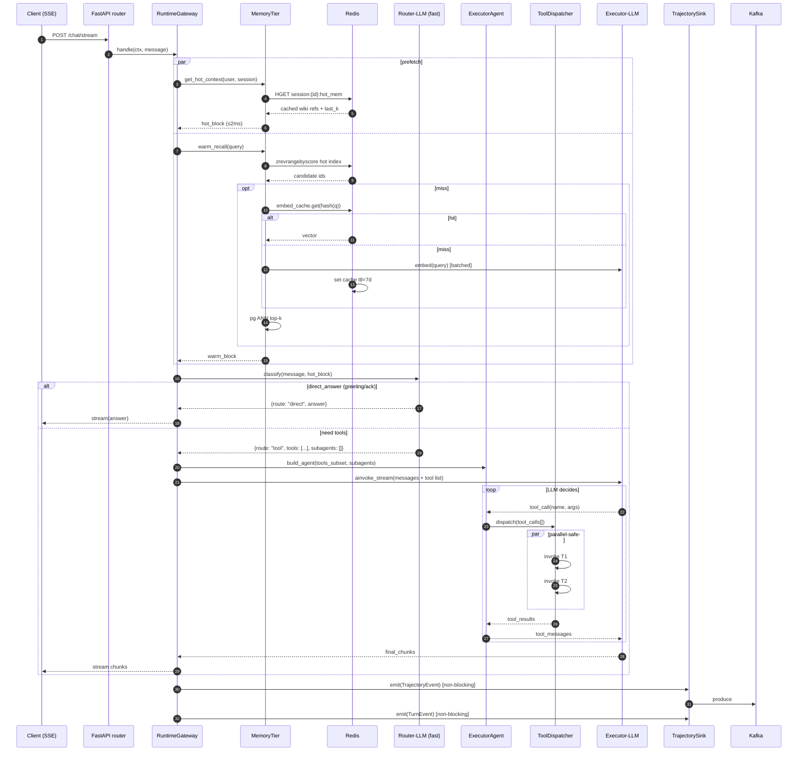
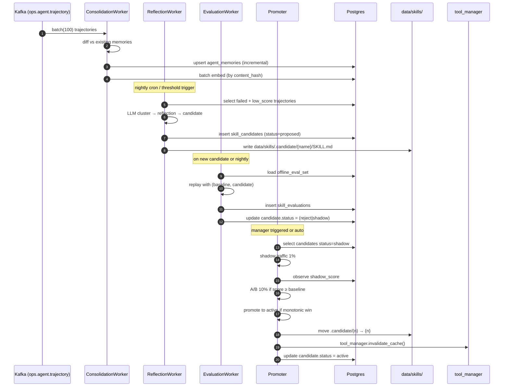

# Design Document: Agent Runtime Optimization & Evolution

**Date:** 2026-05-04
**Status:** Draft
**Scope:** AIOpsOS server-side agent runtime, llm-wiki memory system, self-evolution loop
**Related specs:** `docs/superpowers/specs/2026-05-01-builtin-agents-tools-design.md`, `docs/superpowers/specs/2026-05-01-data-ingestion-design.md`


## Overview

本设计针对 AIOpsOS 当前 agent runtime 的三个核心痛点，提出一次性、可渐进落地的重构方案：

1. **对话路径延迟** — 当前 `POST /api/v1/chat(/stream)` 在真正回答前至少会穿过"关键词意图判定 + 工具热加载 + 两路记忆拉取 + `deepagents.create_deep_agent` 主循环"四段串行链路，其中工具热加载、记忆检索、title 生成、子智能体委托都存在冷路径 LLM 调用或可并行但被串行化的 DB/Redis I/O。本方案将主路径重构为"请求路由 → 轻量 Router-LLM（快模型）→ 单次 tool-enabled 主 LLM 调用 / 或直接短路回答 → 流式响应"的两层执行模型，同时在 request handler 层把所有外部 I/O 做成"LLM 发起时即已 warm"的 prefetch pipeline。

2. **llm-wiki 记忆系统** — 当前记忆写路径是 in-request 的 LLM 抽取（5 轮 flush + session 结束总结），sleep-time 则由 `SleepDetector` 60s 轮询驱动 `MemoryConsolidationAgent` 串行对每个 idle session 跑一次完整 LLM 压缩。高频写、全量重抽取、无 embedding cache、wiki 页面每次 cold-read，这些都是瓶颈。本方案引入"三层记忆 + 异步工作队列 + 差分合并 + 嵌入缓存 + 预编译 wiki 片段"，让主路径只做读，所有写和总结都归位到 worker。

3. **自进化（hermes-agent 风格）** — 当前代码已有 `SkillReviewAgent`、`skill_manage_tool`、`skill_patch_tool` 和 `data/skills/self-improvement/` 的 `.learnings/` 骨架，但尚未形成"行为 → 轨迹 → 反思 → 候选更新 → 影子验证 → 晋升 → 部署"的闭环，也没有 prompt/skill/tool 级别的 A/B 与回滚。本方案基于已有 skill 目录，补齐 trajectory 日志、reflection/evaluation 管线、candidate store 和带守卫的晋升机制，保持与现有 `DatabaseMemoryProvider` 和 `tool_manager` 的一致。

三个方向共享同一套底层基建：统一的异步工作队列、一致的 trajectory/memory/skill 数据模型、OpenTelemetry 全链路追踪、feature flag。这是设计的重点。


## 现状梳理（Grounding）

### 对话主链路

入口：`server/src/api/execution/router.py` — 两个同构的 handler `chat()` (1589 行文件) 和 `chat_stream()`。

流程（`chat_stream` 为例，`/chat` 结构相同）：

1. 校验 `space_id`，加载 / 创建 `Session`（至少 2 次 DB round-trip）。
2. 插入 user `Message`，`turn_count++`。
3. 失效 `chat:msgs:{session_id}:recent` Redis 缓存。
4. `set_current_user` / `_resolve_space_context`（Space 查询，已有 300s 内存 TTL 缓存）。
5. 加载 model_provider（可选 1 次 DB round-trip）。
6. `get_memory_manager(...)` — 如 cache miss，构造 `MemoryManager` 并同步 read `data/MEMORY.md`、`data/USER.md`。
7. 历史消息回放：Redis 读 `chat:msgs:{session_id}:recent`，未命中则 DB 取 30 条并 cache。
8. `asyncio.gather(mm.system_prompt_block(), mm.prefetch(body.message))` — 内部对 builtin + database 两路 provider 各跑一遍，database provider 再分别做 keyword search + recent fallback（每次 `memory_service.retrieve` 都是 1 次 PG text ILIKE 查询，配 30s Redis 缓存）。
9. `agent = await get_deep_agent()` — 首次冷启动会 `build_deep_agent_from_db()`（查 Agent、Tool、SubAgent、Channel、MCPServer 若干条），之后走全局单例。
10. `await agent.ainvoke({"messages": messages}, config={"recursion_limit": 150})` — 进入 `deepagents.create_deep_agent` 返回的 LangGraph。该 LangGraph 本身采用 ReAct + sub-agent delegation，LLM 依据 system_prompt 决定是否调 `task(sub_agent_name, description)`。
11. 流式场景下在 `event_stream()` 中订阅 LangGraph 事件并转成 SSE。
12. 落盘 assistant `Message`；`mm.sync_turn(...)` 向 `DatabaseMemoryProvider._turn_buffer` 追加，每 5 轮触发一次异步 LLM 抽取（fire-and-forget `asyncio.create_task`）。
13. 若 `len(session.title) < 10`，异步再起一个 LLM 生成 title。
14. `_increment_turn()` 写 session 表，每 15 轮将 `skill_review_due=True`。

当前已有的优化：
- `_classify_intent_fast()` 关键词意图分类（未进入主路径，仅在 routing 提示中可用）。
- `_reload_tools_if_stale()` 5 分钟 TTL 内不重复 DB 查工具。
- `_space_ctx_cache` / `_mm_cache` / `chat:msgs:*` Redis TTL 缓存。
- `asyncio.gather` 在 system_prompt_block + prefetch 之间并行。

痛点：
- **A. 可视路径 LLM 调用 ≥ 2 次**：title 生成（后台但仍占用 LLM quota）+ 主 agent 内每次 plan/route/tool 循环（DeepAgents 平均 3-6 次 LLM 调用）。对简单问答也会走完整链路。
- **B. 记忆双读**：`system_prompt_block()` 和 `prefetch()` 查的内容高度重叠（personal/team 最近 N 条），却走了两次 DB。
- **C. 历史消息反序列化**：每次流式会话都会把最近 30 条消息实体化为 LangChain `HumanMessage/AIMessage`，但 DeepAgents 内部也维护一套 state，存在重复上下文。
- **D. 关键词意图分类未被用来短路**：即使是"你好"这种显然不需要工具的 query，依然进入完整 DeepAgents 图。
- **E. 工具选择空间过大**：`deep_agent` 被装配所有 KNOWLEDGE_TOOLS + CRON_QUERY_TOOLS + MCP + skills + 8 个子 agent 的 `task`，prompt token 膨胀，首 token 延迟随之升高。
- **F. 热路径上的冷启动**：`get_deep_agent()` 首次调用会触发 `build_deep_agent_from_db()`；服务刚重启后的第一次用户请求实测几百 ms 只是在建 agent。虽然 `_init_optional` 里做了 pre-warm，但 skill_sync 失败或 DB 慢时 pre-warm 会失败。

### llm-wiki 记忆系统

相关代码：

| 文件 | 作用 |
|------|------|
| `server/src/services/memory_provider.py` | `MemoryManager` / `BuiltinMemoryProvider`（文件） / `DatabaseMemoryProvider`（PG） |
| `server/src/services/memory_service.py` | `memory_service.store / retrieve / summarize_session`（PG agent_memories 表） |
| `server/src/services/sleep_detector.py` | 60s 轮询，5min idle 触发 consolidation 和 skill review |
| `server/src/agent/sub_agents/memory_consolidation_agent.py` | 一次完整 LLM 重抽取 session 的 80 条消息 |
| `server/src/services/kb_summarizer.py` | llm-wiki 5 阶段 compile：ingest → summarize → crossref → finalize → index |
| `server/src/services/kb_monitor.py` | 文件系统 watch `data/knowledge/raw/`（30s poll）触发 compile |
| `server/data/MEMORY.md` / `USER.md` | builtin provider 的全局短记忆文件 |
| `data/knowledge/wiki/` / `raw/` / `meta/` | llm-wiki 三层存储 |
| DB 表 `agent_memories` | `id, session_id, user_id, scope(personal/team), content, embedding(Vector 1536, 目前多为 NULL), tags(jsonb), space_id` |

当前的核心特征：
- 写路径：每 5 轮 turn，LLM 抽取成 personal + team JSON，分别 `INSERT INTO agent_memories`。`embedding=NULL`，仅靠 `ILIKE %query%` + tags jsonb contains 查询。
- Session 结束 (`/sessions DELETE` 或 sleep detector 命中) 再跑一次 `memory_service.summarize_session` 全量 LLM 压缩。
- llm-wiki compile 是另一条独立的异步链路，由 `kb_monitor` 文件扫描驱动，跑在 FastAPI 同一进程的 background task 中。
- 没有嵌入向量：`Vector(1536)` 列存在但未填充，因为未配置 embedding provider（`settings.embedding_api_key=""`）。
- `system_prompt_block` + `prefetch` 每个 turn 都读一次 DB，中间 30s Redis 缓存可以 mitigate 但 key 粒度到 `user+scope+limit+space+sha256(query)[:12]`，实际命中率低（每个 query 都是新 sha）。
- `BuiltinMemoryProvider` 每个 turn 同步读 `MEMORY.md` / `USER.md`（虽然 `_mm_cache` 60s TTL 能挡掉一部分）。

痛点：
- **G. 写放大**：每 5 轮 turn 触发一次 LLM 全量抽取，而 LLM 对同一 session 的"累积对话"重复做了很多相同的 summarization。
- **H. 读放大 + 低命中率缓存**：prefetch 的 Redis key 含 query hash，每个 query 都是新 key。
- **I. 全量 session summarize**：`memory_consolidation_agent` 在 session idle 5min 后会把 80 条消息再整体抽一次，与 sync_turn 已经抽过的内容高度重叠。
- **J. 没有 embedding**：text ILIKE 做不到语义召回，团队记忆里大量有用经验无法被不同措辞的 query 命中。
- **K. 轮询式调度**：`SleepDetector` 单协程每 60s 扫一次，单 tick 最多处理 20 个 session + 5 个 skill review，高并发会积压；且它和 FastAPI 在同一进程，GIL + asyncio 事件循环竞争导致 consolidation 长 LLM 调用阻塞 detector tick。
- **L. llm-wiki 每次从原始数据再生成**：`kb_summarizer.compile_pipeline` 每次都读 raw 原文 12KB 并全量跑 LLM，不做差分；wiki 页面也不带"可直接拼接给 agent"的摘要字段。
- **M. 观测盲区**：除了 `logger.info`，没有 latency histogram、队列深度、命中率、LLM token 统计。

### 自进化相关资产

| 资产 | 位置 | 作用 |
|------|------|------|
| `SkillReviewAgent` | `server/src/agent/sub_agents/skill_review_agent.py` | 每 15 轮或 idle 时扫 session，LLM 建议创建新 skill |
| `skill_manage_tool` | `server/src/agent/tools/skill_manage_tool.py` | 主 agent 可调用的 "create/update/list skill" 工具 |
| `skill_patch_tool` | `server/src/agent/tools/skill_patch_tool.py` | 主 agent 可调用的 "修复过时技能" 工具 |
| `data/skills/<name>/SKILL.md` | 文件系统 | DeepAgents 的 progressive-disclosure skill 目录 |
| `data/skills/self-improvement/.learnings/` | 文件系统 | LEARNINGS/ERRORS/FEATURE_REQUESTS 三类日志 |
| `hermes_skill_scanner.py` | `server/src/services/` | 扫描 `tmp/hermes-agent` 的 skill 目录并注册到 DB（tools 表 type=skill） |
| `Tool` 表 | `server/src/models/agent.py` | `is_builtin`、`is_approved`、`config.skill_prompt` 等字段 |
| `Message.extra_metadata` | `server/src/models/session.py` | 目前仅存 `execution_steps=[]`，可扩展为 trajectory 存储 |

已有能力是"Skill 写入"，缺少的是"写入之前的评估 + 晋升逻辑 + 回滚机制 + 离线评估集"。

### 基础设施约束

- DB 服务：`deploy/docker-compose.dev.yml` 提供 `pgvector/pgvector:pg15`（内置 pgvector 扩展）、`redis:7-alpine`、`confluentinc/cp-kafka:7.5.0`。没有独立向量库、没有 Neo4j。
- Python 依赖已就绪：`celery[redis]` 5.3、`redis` 5.0、`kafka-python` 2.0、`pgvector` 0.3、`langgraph` ≥1.1、`langchain` ≥1.0、`langchain-openai` ≥1.2、`deepagents` 0.5.3、`croniter` 6.2。
- 尚未引入：`arq`、`dramatiq`、`opentelemetry-*`、`langchain-community` 的 embedding provider。
- 当前 Celery 已安装但没有 worker 进程（只作为库），`src/workers/tasks/` 目录是空的。这是一个关键事实：可以直接在这里落地 worker，而不用引入新框架。
- Kafka 已部署且在用（`kafka_source_manager.py` 消费告警），可以复用为"trajectory/consolidation"事件总线。


## Architecture

### 总体架构

```mermaid
graph TB
  subgraph "Request Path (在线, p95 < 2s 首 token)"
    A[HTTP POST /chat/stream<br/>FastAPI router.py] --> B[RuntimeGateway<br/>统一入口 + 并行 prefetch]
    B --> C{Router-LLM<br/>小模型 + cache}
    C -- shortcut --> D1[直接回答<br/>无工具]
    C -- tool_call --> D2[Executor-LLM<br/>单次 tool-enabled]
    C -- delegate --> D3[Sub-agent<br/>knowledge / ops / ...]
    D2 --> E[ToolDispatcher<br/>并行 + 缓存 + 预算]
    D1 --> F[SSE Stream]
    D2 --> F
    D3 --> F
    F --> G[Trajectory Sink<br/>埋点, 非阻塞]
  end

  subgraph "Offline Path (worker 进程)"
    G -. kafka topic: ops.agent.trajectory .-> W[Celery Worker Pool]
    W --> W1[MemoryConsolidator<br/>增量 diff + 批嵌入]
    W --> W2[WikiCompiler<br/>差分 compile]
    W --> W3[SkillReviewer<br/>候选 skill 打分]
    W --> W4[Reflector<br/>生成 candidate update]
    W --> W5[Evaluator<br/>offline eval set 回放]
    W --> W6[Promoter<br/>影子 + A/B + 晋升]
  end

  subgraph "Storage"
    PG[(PostgreSQL + pgvector<br/>agent_memories / trajectories /<br/>skill_candidates / evaluations)]
    R[(Redis<br/>LRU + streams + lock)]
    K[(Kafka<br/>ops.agent.trajectory /<br/>ops.agent.consolidation)]
    FS[data/knowledge/ wiki/<br/>data/skills/ .candidate/ .active/]
  end

  B --> R
  B --> PG
  E --> R
  W1 --> PG
  W2 --> FS
  W3 --> FS
  W3 --> PG
  W4 --> PG
  W5 --> PG
  W6 --> FS
  W6 --> PG
```

### 核心组件职责

| 组件 | 新建/改造 | 位置 | 职责 |
|------|----------|------|------|
| **RuntimeGateway** | 新建 | `server/src/services/agent_runtime/gateway.py` | 所有 `chat` / `chat_stream` 的统一前置层：上下文解析、并行 prefetch、router-LLM 触发、短路决策 |
| **RouterLLM** | 新建 | `server/src/services/agent_runtime/router.py` | 用快模型（`deepseek-v4-flash` 或更小）一次调用得出 `(intent, route, tools, need_sub_agent, direct_answer?)` 结构化输出 |
| **ExecutorAgent** | 改造 | `server/src/agent/deep_agent.py` | 把现有 DeepAgents 单例"工具全装"模式改成"按 RouterLLM 返回的 tool 子集 + sub-agent 列表动态装配"；保留 `get_deep_agent()` 兜底路径 |
| **ToolDispatcher** | 新建 | `server/src/services/agent_runtime/dispatcher.py` | 并行执行标记 `parallel-safe` 的工具（`tool_manager` 已有 safety 字段），对确定性工具开启结果缓存 |
| **TrajectorySink** | 新建 | `server/src/services/agent_runtime/trajectory.py` | 向 Kafka topic 写 `TrajectoryEvent`，本地异步批量落 `agent_trajectories` 表 |
| **MemoryTier** | 新建 | `server/src/services/memory/tier.py` | 三层记忆：HOT(Redis) / WARM(PG+pgvector) / COLD(wiki filesystem) 的读路径聚合 |
| **EmbeddingService** | 新建 | `server/src/services/memory/embedding.py` | 批嵌入 + 按 content_hash 缓存 + 降级（嵌入不可用时退化为 ILIKE） |
| **ConsolidationWorker** | 改造 | `server/src/workers/tasks/memory_consolidation.py` | 从 `memory_consolidation_agent.py` 抽出的 Celery task：差分合并、批嵌入、写 HOT/WARM |
| **WikiCompilerWorker** | 改造 | `server/src/workers/tasks/wiki_compile.py` | `kb_summarizer.compile_pipeline` 拆出 Celery task；按 raw 文件 sha256 做幂等跳过；wiki 页追加 `precomputed_summary` 字段 |
| **SleepScheduler** | 改造 | `server/src/services/sleep_scheduler.py` | 替代 `sleep_detector.py` 的轮询：基于 write-pressure + Redis sorted set 调度；触发 Celery task；带资源配额 |
| **ReflectionWorker** | 新建 | `server/src/workers/tasks/reflection.py` | 定时（或按 trajectory volume 触发）跑 LLM reflection，把失败/低分 trajectory 归类，产出 candidate（skill、prompt patch、tool param） |
| **Evaluator** | 新建 | `server/src/workers/tasks/evaluator.py` | 对 candidate 在 offline eval set 上回放，计算 baseline vs candidate 的得分 |
| **Promoter** | 新建 | `server/src/services/evolution/promoter.py` | 影子模式 → 小流量 A/B → 全量晋升；每一步带 guard（失败率、回归阈值） |
| **SkillCandidateStore** | 新建 | `server/src/services/evolution/candidate_store.py` | `skill_candidates` 表 + `data/skills/.candidate/` 目录管理；`promote` 时移动到 `data/skills/` 并在 `Tool` 表注册 |
| **Observability** | 新建 | `server/src/core/tracing.py` | OpenTelemetry 初始化 + 各阶段 span + latency histogram |

### 与现有管控/执行面的关系

- `main_control.py` 只暴露管理 API（`/evolution/candidates`、`/memory/metrics`）。
- `main_execution.py` 承载 `chat` / `chat/stream`，即本设计的主路径。
- Celery worker 独立进程启动：`celery -A src.workers.app worker -Q memory,evolution,wiki -c 4`。
- 开发模式（`service_type=allinone`）允许在 FastAPI 进程内起一个 in-process worker 以便不依赖 worker 就能跑通，但仍走同一份 Celery task 代码（用 `celery -A ... --pool=solo` 嵌入式或直接 `await task.run()`）。


### 主对话序列图



### 离线进化流程图




## Components and Interfaces

### RuntimeGateway

**新文件**：`server/src/services/agent_runtime/gateway.py`

**职责**：统一 `chat` / `chat_stream` 的入口逻辑。取代 `router.py` 中的 ~150 行粘合代码。

```python
interface RuntimeContext:
    user: User
    session: Session
    space_id: str | None
    model_provider_id: str | None
    request_id: str           # w3c trace-id
    platform: str             # web / wecom-bot / cron

interface GatewayResult:
    route: Literal["direct", "executor", "subagent"]
    tokens_stream: AsyncIterator[StreamEvent]
    trajectory_id: UUID
    metadata: dict            # latency breakdown, tools used, tokens

class RuntimeGateway:
    async def handle(
        self,
        ctx: RuntimeContext,
        message: str,
    ) -> GatewayResult: ...
```

**responsibilities**：
- 建立 / 加载 Session；写入 user Message。
- 起一组并行 task：`MemoryTier.hot(ctx)`、`MemoryTier.warm_recall(ctx, message)`、`history_cache.get(session_id)`。
- 如 `FeatureFlags.router_llm_enabled`，调 `RouterLLM.classify(...)`；否则直连 `ExecutorAgent`（保留兜底）。
- 根据 router 返回值走三条分支：`direct` / `executor` / `subagent`。
- 在流式响应的同时，写 assistant Message、`sync_turn`、emit trajectory。

### RouterLLM

**新文件**：`server/src/services/agent_runtime/router.py`

**职责**：一次轻量结构化 LLM 调用，替代现有"意图识别 + 再开始工具选择"的双段。

**prompt 尺寸目标**：< 1.5k tokens（对比当前主 agent system prompt 约 8k）。

**输入**：
- 最近 N 条对话的压缩摘要（从 `hot_block` 来）。
- 本轮 user message。
- `tool_manager.describe_skills_compact()` 的 top-40 条（已经存在这个方法，压缩成 1 行/skill）。
- 可选的 routing table（来自 `_build_routing_table`）。

**输出（JSON）**：

```python
class RouterDecision(BaseModel):
    route: Literal["direct", "executor", "subagent"]
    direct_answer: str | None              # route=direct 时填
    subagent_name: str | None              # route=subagent 时填
    suggested_tools: list[str] = []        # executor 时候补
    reason: str                            # 给观测/调试
    confidence: float                      # 0..1
```

**缓存**：以 `(user_id, last_user_msg_sha, last_assistant_sha)` 为 key，TTL 30s，命中跳过 RouterLLM 调用。

**降级**：RouterLLM 超时（>500ms）或返回异常时自动降级为 `route=executor, suggested_tools=None`（即走原有 DeepAgents 路径）。

### ExecutorAgent（现有 deep_agent 的改造）

**改造点**：
- `build_deep_agent_from_db()` 增加 `build_for(tools_subset, subagents_subset)` 的变体。
- 引入 LRU：以 `(tool_name_frozenset, subagent_name_frozenset)` 为 key 缓存 compiled graph（DeepAgents 构建代价可观）。LRU 大小 32。
- 当 RouterLLM 给出 `suggested_tools=[t1, t2]` 时，只装配这些工具 + `read_file / write_file / execute` 三个必备 builtin。
- 保留全量 fallback：若无 suggested_tools，走原 `get_deep_agent()`。

### ToolDispatcher

**新文件**：`server/src/services/agent_runtime/dispatcher.py`

```python
class ToolExecutionRequest:
    tool_name: str
    args: dict
    tool_call_id: str
    trajectory_id: UUID

class ToolExecutionResult:
    tool_call_id: str
    ok: bool
    result: str
    latency_ms: int
    cache_hit: bool

class ToolDispatcher:
    async def dispatch_batch(
        self,
        requests: list[ToolExecutionRequest],
    ) -> list[ToolExecutionResult]:
        """Parallel-safe tools run with asyncio.gather; sequential / destructive run in order."""
```

- 读 `tool_manager.get_safety(tool_name)`：`parallel-safe` 并发，其余串行。
- 结果缓存：对 `parallel-safe` 且 args 满足 canonical hash 的调用，Redis `tool:result:{tool_name}:{sha256(args)}` TTL 60s。查询类工具（`grep_kb`/`read_wiki`/`list_cron_jobs`/`memory_retrieve`）默认开启缓存。
- 应用 `tool_manager.apply_output_budget(...)` 裁剪。

### MemoryTier

**新文件**：`server/src/services/memory/tier.py`

三层模型：

```python
class MemoryTier:
    async def hot(self, ctx: RuntimeContext) -> HotBlock: ...
    async def warm_recall(self, ctx: RuntimeContext, query: str, k: int = 8) -> list[MemoryItem]: ...
    async def cold_lookup(self, key: str) -> str | None: ...   # wiki page by slug
```

- **HOT**：Redis hash `session:{sid}:hot_mem`，由 `MemoryWriter`（worker）维护，内容是预拼接好的 markdown：user profile + space ctx + last_k_summaries + top-5 recent personal + top-5 pinned team。TTL 10 分钟，被任何新 turn invalidate。
- **WARM**：`agent_memories` 表 + pgvector ANN（索引 `ivfflat` 或 `hnsw`）。支持 keyword + semantic 混合打分 `0.5 * sim + 0.5 * recency_bm25`。
- **COLD**：wiki filesystem，通过 `kb_summarizer.get_precomputed_summary(slug)` 返回预编译好的段落（不再每次 LLM 拼）。

### EmbeddingService

**新文件**：`server/src/services/memory/embedding.py`

```python
class EmbeddingService:
    async def embed(self, texts: list[str]) -> list[Vector]: ...
    async def embed_one(self, text: str) -> Vector: ...
```

- **批处理窗口**：最多聚合 30ms 或 16 条，先到先发。
- **内容哈希缓存**：Redis key `emb:{model}:{sha256(text)[:16]}`，TTL 7d。命中率目标 > 60%（记忆复读多）。
- **降级**：`settings.embedding_api_key == ""` 时 `embed` 返回空向量，MemoryTier warm_recall 自动退化为 ILIKE。
- **模型**：复用 `settings.embedding_model` 默认 `text-embedding-3-small`，可在 model_provider 表里覆盖。

### MemoryWriter / ConsolidationWorker

**Celery task**：`server/src/workers/tasks/memory_consolidation.py`

取代当前的"每 5 轮 LLM 全量抽取"。改为：

1. `TrajectorySink` 把每轮 `(user_msg, assistant_msg, tool_calls, outcome)` 写到 Kafka。
2. `ConsolidationWorker` 按 session 消费，**增量 diff 合并**：
   - 取该 session 已有的 `agent_memories` 作为 baseline。
   - 对新 turn 运行一个更短的 LLM prompt：`"给定 baseline 记忆 + 一轮新对话, 输出三个列表: new_personal, new_team, supersedes(id list)"`。
   - `supersedes` 的记忆被标 `is_archived=True`（保留历史）。
   - 新记忆批量 embed → insert。
3. 预编译 HOT 片段：把该用户 top-5 recent personal + top-5 pinned team + user profile 拼成 markdown 写到 `session:{sid}:hot_mem`。

### WikiCompilerWorker

**Celery task**：`server/src/workers/tasks/wiki_compile.py`

- 取代 `kb_monitor.py` 的 in-process compile 调用。
- 幂等：以 raw 文件的 `sha256` 作为已编译标记；相同 sha 跳过。
- 差分：新版本调用 LLM 时提供"旧 wiki 页 + 新 raw 版本的 diff"，LLM 只更新变化部分的段落。
- wiki 页 frontmatter 新增 `precomputed_summary`（≤ 300 字）供 cold_lookup 直接拼接。

### SleepScheduler

**改造**：`server/src/services/sleep_scheduler.py` 取代 `sleep_detector.py`。

- Redis `ZSET` key `sleep:queue`：score 为"应开始 consolidation 的时间戳"。
- 每次 `/chat` 完成后，写 `ZADD sleep:queue last_active_at+5min session_id`。
- 独立的 `sleep_scheduler_loop` 每 5 秒 ZRANGEBYSCORE 0 now，取出到期 session，`celery_task.delay(sid)`。
- 资源配额：全局令牌桶，默认 ≤ 4 并发 consolidation；单 session 每天最多 6 次 consolidation；LLM token 预算上限 per 天。
- 写压自适应：观测 `sleep:queue` 深度 > 500 时触发"只做增量，跳过重 summary"降级。

### TrajectorySink

**新文件**：`server/src/services/agent_runtime/trajectory.py`

```python
class TrajectoryEvent(BaseModel):
    id: UUID
    session_id: UUID
    user_id: UUID
    space_id: UUID | None
    parent_id: UUID | None       # 子 agent 调用链
    kind: Literal["turn", "tool_call", "subagent", "router_decision", "reflection"]
    ts: datetime
    latency_ms: int | None
    tokens_in: int | None
    tokens_out: int | None
    data: dict                   # kind 特定 payload
    outcome: Literal["ok", "error", "timeout", "rejected"]
    tags: list[str]
```

- 双写：Kafka topic `ops.agent.trajectory`（消费者是 worker）+ 本地 `asyncio.Queue` → 批量 `COPY` 进 `agent_trajectories` 表。
- 非阻塞：`emit()` 是 fire-and-forget，内部 backpressure（queue.maxsize=10000，满了直接丢 + 计 metric）。

### Reflector / Evaluator / Promoter

见下文"自进化架构"章节。

### Observability

**新文件**：`server/src/core/tracing.py`

- 基于 OpenTelemetry SDK，导出到 OTLP（默认打印 stdout，prod 可配 collector）。
- 关键 span：`gateway.handle`、`router_llm.classify`、`memory.hot`、`memory.warm`、`executor.ainvoke`、`tool.{name}`、`consolidation.run`、`reflection.run`。
- 关键 metric（prometheus 文本端点 `/metrics`）：
  - `agent_turn_latency_ms{stage, route}` histogram
  - `agent_tokens_total{direction, model, stage}` counter
  - `memory_recall_hit_ratio{tier}` gauge
  - `sleep_queue_depth` gauge
  - `skill_candidate_count{status}` gauge
  - `trajectory_emit_dropped` counter


## Data Models

### 新增表

```sql
-- 轨迹主表
CREATE TABLE agent_trajectories (
    id UUID PRIMARY KEY DEFAULT gen_random_uuid(),
    session_id UUID NOT NULL REFERENCES sessions(id) ON DELETE CASCADE,
    user_id UUID NOT NULL,
    space_id UUID,
    parent_id UUID REFERENCES agent_trajectories(id) ON DELETE SET NULL,
    kind VARCHAR(32) NOT NULL,            -- turn / tool_call / subagent / router_decision / reflection
    outcome VARCHAR(16) NOT NULL,         -- ok / error / timeout / rejected
    model VARCHAR(64),
    latency_ms INT,
    tokens_in INT,
    tokens_out INT,
    data JSONB NOT NULL DEFAULT '{}',
    tags JSONB NOT NULL DEFAULT '[]',
    created_at TIMESTAMPTZ NOT NULL DEFAULT now()
);
CREATE INDEX trajectory_session_idx ON agent_trajectories(session_id, created_at DESC);
CREATE INDEX trajectory_outcome_idx ON agent_trajectories(outcome, created_at DESC)
    WHERE outcome != 'ok';
CREATE INDEX trajectory_kind_idx ON agent_trajectories(kind, created_at DESC);
CREATE INDEX trajectory_tags_idx ON agent_trajectories USING GIN (tags);

-- 技能候选
CREATE TABLE skill_candidates (
    id UUID PRIMARY KEY DEFAULT gen_random_uuid(),
    name VARCHAR(128) NOT NULL,
    proposal_source VARCHAR(32) NOT NULL,  -- reflection / user_feedback / skill_review_agent
    origin_trajectory_ids UUID[],
    status VARCHAR(16) NOT NULL DEFAULT 'proposed',
    -- proposed → shadow → ab → active | rejected | retired
    skill_prompt TEXT NOT NULL,
    description TEXT,
    tags JSONB DEFAULT '[]',
    tool_names JSONB DEFAULT '[]',
    baseline_skill_id VARCHAR(128),         -- 如果是对已有 skill 的补丁
    manifest_sha256 VARCHAR(64),
    created_at TIMESTAMPTZ NOT NULL DEFAULT now(),
    updated_at TIMESTAMPTZ NOT NULL DEFAULT now()
);
CREATE INDEX skill_candidate_status_idx ON skill_candidates(status, updated_at DESC);
CREATE UNIQUE INDEX skill_candidate_name_status_idx ON skill_candidates(name, status)
    WHERE status IN ('shadow', 'ab', 'active');

-- 评估记录
CREATE TABLE skill_evaluations (
    id UUID PRIMARY KEY DEFAULT gen_random_uuid(),
    candidate_id UUID NOT NULL REFERENCES skill_candidates(id) ON DELETE CASCADE,
    eval_set_name VARCHAR(64) NOT NULL,
    baseline_score NUMERIC(6,4),
    candidate_score NUMERIC(6,4),
    n_samples INT,
    details JSONB NOT NULL DEFAULT '{}',
    passed BOOLEAN NOT NULL,
    created_at TIMESTAMPTZ NOT NULL DEFAULT now()
);
CREATE INDEX skill_eval_candidate_idx ON skill_evaluations(candidate_id, created_at DESC);

-- 离线评估集（可手动维护或从 trajectory 提取）
CREATE TABLE eval_set_items (
    id UUID PRIMARY KEY DEFAULT gen_random_uuid(),
    set_name VARCHAR(64) NOT NULL,
    prompt TEXT NOT NULL,
    expected_tools JSONB DEFAULT '[]',      -- 正确应调用的工具子集
    expected_outcome VARCHAR(16),           -- 'answered' / 'delegated' / 'refused'
    grading_prompt TEXT,                    -- LLM-as-judge 打分 rubric
    weight NUMERIC(4,2) DEFAULT 1.0,
    created_at TIMESTAMPTZ NOT NULL DEFAULT now()
);
CREATE INDEX eval_item_set_idx ON eval_set_items(set_name);

-- feature flag
CREATE TABLE runtime_feature_flags (
    key VARCHAR(64) PRIMARY KEY,
    enabled BOOLEAN NOT NULL DEFAULT FALSE,
    rollout_percent INT NOT NULL DEFAULT 0,   -- 0..100
    data JSONB DEFAULT '{}',
    updated_at TIMESTAMPTZ NOT NULL DEFAULT now()
);
```

### 已有表的扩展

```sql
-- agent_memories 扩展
ALTER TABLE agent_memories
    ADD COLUMN content_hash VARCHAR(64),                   -- for embedding cache lookup
    ADD COLUMN is_archived BOOLEAN NOT NULL DEFAULT FALSE, -- supersedes 标记
    ADD COLUMN superseded_by UUID REFERENCES agent_memories(id) ON DELETE SET NULL,
    ADD COLUMN pinned BOOLEAN NOT NULL DEFAULT FALSE,      -- 手动置顶到 HOT
    ADD COLUMN last_used_at TIMESTAMPTZ;                   -- 更新 recency

CREATE INDEX agent_memories_active_idx ON agent_memories(user_id, scope, created_at DESC)
    WHERE is_archived = FALSE;
-- pgvector ANN 索引（embedding IS NOT NULL 时）
CREATE INDEX agent_memories_embed_idx ON agent_memories
    USING hnsw (embedding vector_cosine_ops)
    WHERE embedding IS NOT NULL;

-- sessions 扩展
ALTER TABLE sessions
    ADD COLUMN last_consolidation_at TIMESTAMPTZ,
    ADD COLUMN consolidation_count INT NOT NULL DEFAULT 0,
    ADD COLUMN hot_memory_version INT NOT NULL DEFAULT 0;

-- messages 扩展（轻量，避免迁移 Message 表本身）
-- trajectory 是独立表，Message.extra_metadata 可选保留 execution_steps 摘要
```

### Redis 键空间约定

| key pattern | type | TTL | 用途 |
|-------------|------|-----|------|
| `session:{sid}:hot_mem` | HASH | 10min | MemoryTier.hot 返回的预拼接 markdown |
| `session:{sid}:msgs_recent` | LIST(json) | 10min | 最近 30 条消息（取代当前 `chat:msgs:...` 的 cache） |
| `router:decision:{h}` | STRING(json) | 30s | RouterLLM 结果缓存 |
| `tool:result:{name}:{h}` | STRING | 60s | ToolDispatcher 幂等工具结果 |
| `emb:{model}:{h}` | STRING | 7d | 嵌入缓存 |
| `sleep:queue` | ZSET | — | Session consolidation 调度队列 |
| `evo:shadow:{flag}` | STRING | — | 影子流量计数 |
| `metrics:hit_ratio:{tier}` | STRING | — | 观测用 gauge |

### Kafka topics

| topic | producer | consumer | 内容 |
|-------|----------|----------|------|
| `ops.agent.trajectory` | TrajectorySink | ConsolidationWorker / ReflectionWorker | TrajectoryEvent JSON |
| `ops.agent.reflection` | ReflectionWorker | Evaluator | `{candidate_id, trigger}` |
| `ops.agent.promotion` | Promoter | tool_manager 订阅者（invalidate） | `{skill_name, from, to}` |

### Kafka 管理面（强依赖能力）

Kafka 在本平台是一等基础设施，需要内建管理界面与 API。

**管理对象**：
- **Topic 生命周期**：创建、删除、修改 partitions / replication / retention / compression。
- **Consumer Group**：列表、offset、lag、成员状态、reset offset（earliest / latest / timestamp / specific）。
- **消息面板**：按 topic / partition / offset 浏览、搜索（header / key / value regex）、导出为 JSONL。
- **死信队列（DLQ）**：所有 worker 失败 ≥ 3 次的消息进入 `ops.agent.*.dlq`；管理页可重放、丢弃、标记已处理。
- **Schema Registry**：TrajectoryEvent / CandidateEvent 等 schema 版本化；producer 写入前校验。
- **告警规则**：lag ≥ 阈值、消费停滞、DLQ 增速 > N/分、topic 不可写入（ISR 降级）。

**实现组件**：

| 组件 | 位置 | 职责 |
|------|------|------|
| `KafkaAdminService` | `server/src/services/kafka/admin.py` | 基于 `aiokafka.admin.AIOKafkaAdminClient` + `confluent_kafka.admin.AdminClient`（补偿） 封装 topic/group/acl 操作 |
| `KafkaMetricsCollector` | `server/src/services/kafka/metrics.py` | 5s 一次拉取 lag、partition health、broker metrics 暴露到 Prometheus |
| `KafkaBrowser` | `server/src/services/kafka/browser.py` | Server-side paginated seek + consume，前端按需分页加载 |
| `KafkaDLQManager` | `server/src/services/kafka/dlq.py` | 死信回放（可选改目标 topic）、批量丢弃、按 tag 过滤 |
| `KafkaSchemaRegistry` | `server/src/services/kafka/schema.py` | 本地 JSON Schema 版本表 `kafka_topic_schemas`；发布时按版本号校验；不强依赖 Confluent Schema Registry（可选集成） |
| API 路由 | `server/src/api/control/kafka.py` | `/api/control/kafka/topics`、`/consumer-groups`、`/browser`、`/dlq`、`/schemas` |

**平台默认注册的 topics（由 alembic + infra migration 自动创建）**：

| topic | partitions | replication | retention | compaction | schema |
|-------|------------|-------------|-----------|-----------|--------|
| `ops.agent.trajectory` | 6 | 3 | 30d | no | TrajectoryEvent.v1 |
| `ops.agent.trajectory.dlq` | 3 | 3 | 90d | no | DLQEnvelope.v1 |
| `ops.agent.reflection` | 3 | 3 | 14d | no | ReflectionTrigger.v1 |
| `ops.agent.promotion` | 3 | 3 | 30d | yes (key=skill_name) | PromotionEvent.v1 |
| `ops.agent.feedback` | 3 | 3 | 180d | no | UserFeedback.v1 |
| `ops.alert.normalized` | 12 | 3 | 7d | no | AlertEvent.v1 (已存在) |

**安全**：ACL 按 `space_id` 隔离；客户端连接强制 SASL/SCRAM（生产）；dev-compose 允许 PLAINTEXT。

**新增配置**：

```python
# server/src/core/config.py
KAFKA_BOOTSTRAP_SERVERS: str = "kafka:9092"
KAFKA_CLIENT_ID_PREFIX: str = "aiopsos"
KAFKA_SASL_MECHANISM: str | None = None
KAFKA_SASL_USERNAME: str | None = None
KAFKA_SASL_PASSWORD: str | None = None
KAFKA_DEFAULT_PARTITIONS: int = 3
KAFKA_DEFAULT_REPLICATION: int = 3
KAFKA_TOPIC_DLQ_SUFFIX: str = ".dlq"
KAFKA_PRODUCE_TIMEOUT_MS: int = 5000
KAFKA_CONSUME_BATCH_SIZE: int = 100
```

**关键属性（纳入 PBT / 集成测试）**：
- Topic 自动迁移：新部署启动时若缺少必要 topic，admin 自动创建；失败则 `/readyz` 不通过。
- 生产端 schema 校验：不合规事件 **不进入 topic**，直接入 DLQ + 计数。
- DLQ 不静默丢弃：所有 dead-lettered 消息 id 可通过 `/dlq` 列出与重放，repeat 操作幂等。


## Low-Level Design — 痛点 1：对话路径延迟

### 关键路径预算（p95 目标）

| 阶段 | 当前实测粗估 | 目标 | 做法 |
|------|--------------|------|------|
| FastAPI deps + space ctx | 20–50ms | 10–20ms | 减少 DB round-trip，space ctx 已有缓存 |
| history + memory fetch | 150–400ms | 20–80ms | MemoryTier.hot 用 Redis hash 预拼接 |
| Router-LLM | — | 80–250ms | 小模型 / cache 命中直接跳过 |
| 主 LLM 首 token | 400–1500ms | 300–800ms | 更短 system prompt（router 已过滤工具）+ streaming |
| 工具执行（若有） | 200–4000ms | 100–2500ms | 并行 + 缓存 + budget |
| **首 token 总** | **~2–3s** | **< 1s（p95）** | |

### 主路径伪代码

```pascal
PROCEDURE HandleChatStream(ctx: RuntimeContext, message: String)
  INPUT: ctx, message
  OUTPUT: AsyncIterator[SSEEvent]

  // --- 前置：DB session + user msg ---
  session ← UpsertSession(ctx)
  EmitToDB(Message(role=user, content=message, session_id=session.id))

  // --- 并行 prefetch（最大 3 路）---
  PARALLEL
    hot_block       ← MemoryTier.hot(ctx)                 // Redis HGET, ≤5ms
    history_slice   ← HistoryCache.get(session.id)        // Redis LRANGE 或 DB limit 30
    warm_candidates ← MemoryTier.warm_recall(ctx, message, k=8)  // pgvector ANN
  END PARALLEL

  // --- Router 决策 ---
  IF FeatureFlags.router_llm_enabled THEN
    cache_key ← sha256(message + last_asst_sha + user_id)
    decision  ← RedisGet("router:decision:" + cache_key)
    IF decision IS NULL THEN
      decision ← RouterLLM.classify(
        message=message,
        hot_block=hot_block,
        history=history_slice.last(4),
        tool_index=tool_manager.describe_skills_compact(),
        timeout_ms=500,
      )
      RedisSet("router:decision:" + cache_key, decision, ttl=30)
    END IF
  ELSE
    decision ← {route: "executor", suggested_tools: NULL, subagent: NULL}
  END IF

  TrajectoryId ← uuid7()
  TrajectorySink.emit(kind="router_decision", data=decision, id=TrajectoryId)

  // --- 分流 ---
  SWITCH decision.route
    CASE "direct":
      yield ToSSE(decision.direct_answer)
      reply ← decision.direct_answer
    CASE "subagent":
      yield from StreamSubagent(decision.subagent_name, message, ctx, hot_block, warm_candidates)
    CASE "executor":
      agent ← ExecutorAgentPool.build(
        tools = decision.suggested_tools OR tool_manager.default_essentials(),
        subagents = NULL,
      )
      messages ← AssembleMessages(hot_block, warm_candidates, history_slice, message)
      yield from StreamExecutor(agent, messages, TrajectoryId)
  END SWITCH

  // --- 后置：非阻塞 ---
  FORK
    EmitToDB(Message(role=assistant, content=reply, session_id=session.id))
    TrajectorySink.emit(kind="turn", id=TrajectoryId, latency_ms=elapsed)
    RedisPush("sleep:queue", session.id, score=now() + 5min)
    TouchHistoryCache(session.id, message, reply)
  END FORK
END PROCEDURE
```

**Preconditions:**
- `ctx.user` 已通过 JWT 解析（`get_current_user` 依赖项）。
- `session_id` 若指定则合法或会新建。
- RouterLLM 的目标模型已在 `model_provider` 表注册，标记 `role=router`。

**Postconditions:**
- 至少一条 SSE 已 flush 给客户端（即使是直接回答）。
- `agent_trajectories` 里存在 `kind=router_decision` + `kind=turn` 两条记录。
- `sleep:queue` 里该 session 的 score 被更新为 now+5min。
- 失败时：主路径异常降级为原 `/chat/stream` 行为（包含 `route_llm_failed` 标签）。

**Loop invariants:**
- LLM 主循环每次迭代后：`unexecuted_tool_calls.length` 严格递减直到 0。
- 流式输出："已 flush 的字节数"单调不减。

### RouterLLM 详细设计

**模型选择**：
- 默认 `deepseek-v4-flash`（已在 `default model_name`），单次 < 300ms。
- 允许通过 `model_providers.role='router'` 指定更小模型。

**提示词结构**：

```
[SYSTEM]
你是 AIOpsOS 的请求路由器。只输出 JSON。

[工具索引 (压缩)]
{tool_manager.describe_skills_compact, top 40}

[子 agent 索引]
- knowledge: 知识库
- monitor: 告警监控
- ops: 系统操作
- analysis: 数据分析
- cmdb_ingestion: CMDB 同步
- a2ui_generator: 交互式UI
- report_generator: 报告

[最近摘要]
{hot_block.last_k_summary | truncate 400}

[用户信息]
{hot_block.user_profile | truncate 150}

[USER]
{message}

[OUTPUT JSON]
{
  "route": "direct|executor|subagent",
  "direct_answer": "...",        // 仅 route=direct
  "subagent_name": "...",        // 仅 route=subagent
  "suggested_tools": [],         // executor 时最多 5 个
  "reason": "...",
  "confidence": 0.0-1.0
}
```

**降级规则**：
- `confidence < 0.4` → 强制回退 `executor` 全工具（兜底）。
- `route=direct` 但问题明显不是闲聊（消息里含 "执行/查询/分析" 关键词）→ 提升为 `executor`。
- 超时/解析失败 → `executor` 全量。

**Function Calling 与兜底**：

```pascal
ALGORITHM RouterLLM.classify(message, ctx, timeout_ms=500)
  // 第 1 路：function calling（硬性优先）
  TRY
    llm_fc ← GetRouterLLM().bind_tools([RouterDecisionTool],
                                        tool_choice={"type": "tool", "name": "decide"})
    result ← AwaitWithTimeout(llm_fc.ainvoke(BuildMessages(...)), timeout_ms)
    decision ← ParseToolCall(result.tool_calls[0])  // 强 schema 校验
    IF Validate(decision) THEN
      Metric("router_path").inc("function_calling")
      RETURN decision
    END IF
  CATCH (ToolChoiceNotSupported, ProviderSchemaError):
    pass   // 进入第 2 路
  CATCH (TimeoutError):
    Metric("router_timeout").inc()
    RETURN FallbackExecutor("timeout")
  END TRY

  // 第 2 路：JSON mode（补充兜底）
  TRY
    llm_json ← GetRouterLLM().with_structured_output(
      RouterDecision, method="json_mode",
    )
    decision ← AwaitWithTimeout(llm_json.ainvoke(BuildMessages(...)), timeout_ms)
    IF Validate(decision) THEN
      Metric("router_path").inc("json_mode")
      RETURN decision
    END IF
  CATCH Any:
    Metric("router_path").inc("fallback_executor")
    RETURN FallbackExecutor("parse_error")
  END TRY
END
```

**决策采集**：函数调用链路命中率在 Prometheus `router_path_total{path="function_calling|json_mode|fallback_executor"}` 观测，目标 `function_calling` 占比 ≥ 95%（生产稳定运行后）。

### ExecutorAgent 装配策略

```pascal
ALGORITHM BuildExecutorAgent(tools_subset, subagents_subset)
INPUT: tools_subset (list[str] or None), subagents_subset (list[str] or None)
OUTPUT: compiled CompiledStateGraph

BEGIN
  key ← (frozenset(tools_subset), frozenset(subagents_subset))
  IF key IN LRUCache THEN
    RETURN LRUCache[key]
  END IF

  essential ← ["read_file", "write_file", "execute"]
  tools ← essential ∪ (tools_subset OR tool_manager.all_builtin())

  subs ← []
  IF subagents_subset IS NOT NULL THEN
    FOR name IN subagents_subset DO
      subs.append(SUBAGENTS_MAP[name])
    END FOR
  END IF

  // 主 system prompt 动态裁剪：只带本批次相关能力章节
  prompt ← Render(AI_OPS_SYSTEM_PROMPT_TEMPLATE,
                  capabilities=infer_caps(tools, subs))

  graph ← create_deep_agent(
    model = await _build_model(),
    tools = [tool_manager.get_tool(t) for t in tools],
    system_prompt = prompt,
    subagents = subs or None,
    backend = _build_backend(),
  )
  LRUCache[key] = graph
  RETURN graph
END
```

**Preconditions:** `tool_manager` 已 reload；所有 `tools_subset` 工具都在 tool_manager 中可用。
**Postconditions:** 返回的 `graph` 至少包含 3 个 essential 工具；prompt token 数 ≤ 3k（用 tiktoken 预估）。

### ToolDispatcher 并行策略

```pascal
PROCEDURE DispatchBatch(calls: list[ToolCall])
  safe, seq, destructive ← partition_by_safety(calls)

  // 1. destructive 必须人工批准（request_approval）
  FOR call IN destructive DO
    approved ← await HumanInterrupt(call)
    IF NOT approved THEN
      results.append(Rejected(call))
      CONTINUE
    END IF
    result ← await Invoke(call)
    results.append(result)
  END FOR

  // 2. parallel-safe 合并调用 + 命中缓存
  FOR call IN safe DO
    cache_key ← "tool:result:" + call.name + ":" + canonical_sha(call.args)
    IF cached ← RedisGet(cache_key) THEN
      results.append(ToolResult(cached, cache_hit=true))
    ELSE
      tasks.append((call, InvokeAsync(call)))
    END IF
  END FOR
  parallel_results ← await asyncio.gather(*tasks)
  FOR (call, r) IN parallel_results DO
    RedisSet("tool:result:..." + call.name, r, ttl=60)
    results.append(r)
  END FOR

  // 3. sequential 逐个跑
  FOR call IN seq DO
    results.append(await Invoke(call))
  END FOR

  RETURN results
END
```

**被标为 `parallel-safe` 的工具（初始集合）：**
`grep_kb`, `read_wiki`, `list_wiki`, `memory_retrieve`, `list_cron_jobs`, `get_config`, `list_datasources`, `query_cmdb_nodes`, `search_logs`, `count_logs`, `search_tickets`, `get_ticket_detail`.

**被标为 `destructive` 的工具：** `execute`（shell）、`write_wiki`、`write_raw`、`cron_create`、`sync_datasource` (`discover/full` 模式)。

**Loop invariant:** 每处理一个 call，`results.length` 严格 +1；最终 `results.length == calls.length`。


## Low-Level Design — 痛点 2：llm-wiki 记忆系统

### 读路径：三层聚合

```pascal
PROCEDURE MemoryTier.hot(ctx: RuntimeContext)
  key ← "session:" + ctx.session.id + ":hot_mem"
  block ← RedisHGetAll(key)
  IF block IS EMPTY THEN
    // 冷启动：从 agent_memories 最近 TOP_K 个 personal + pinned team + user profile 拼接
    block ← BuildHotBlockFromDB(ctx.user.id, ctx.session.id, ctx.space_id)
    RedisHSet(key, block, ttl=600)
  END IF
  RETURN block
END

PROCEDURE MemoryTier.warm_recall(ctx, query, k)
  INPUT: ctx, query, k
  OUTPUT: list of MemoryItem ranked by score

  // 1. 嵌入向量（带缓存）
  IF EmbeddingService.enabled THEN
    v ← EmbeddingService.embed_one(query)
    rows ← PG.execute("""
      SELECT id, title, content, scope, tags, created_at,
             1 - (embedding <=> :q) AS sim,
             EXTRACT(EPOCH FROM (now() - created_at)) / 86400 AS age_days
      FROM agent_memories
      WHERE user_id = :uid AND is_archived = FALSE
        AND embedding IS NOT NULL
        AND (scope = 'team' OR user_id = :uid)
        AND (space_id IS NULL OR space_id = :sid)
      ORDER BY embedding <=> :q
      LIMIT :k2
    """, q=v, uid=ctx.user.id, sid=ctx.space_id, k2=k*3)
  ELSE
    // 降级：ILIKE
    rows ← PG.execute(keyword_query(query), limit=k*3)
  END IF

  // 2. 混合打分：semantic * 0.5 + recency * 0.3 + pinned * 0.2
  FOR row IN rows DO
    recency ← 1 / (1 + row.age_days / 7)
    score   ← 0.5 * row.sim + 0.3 * recency + 0.2 * (1 IF row.pinned ELSE 0)
    row.score ← score
  END FOR
  rows.sort(by=score, desc=true)
  RETURN rows[:k]
END
```

### 写路径：TurnEvent → 增量 Consolidation

**设计要点：** 把现有 `DatabaseMemoryProvider.sync_turn` 的"每 5 轮 flush → in-request LLM extract"改成 **"每轮 emit → worker 消费"**，主路径 0 LLM 开销。

```pascal
PROCEDURE sync_turn(user_msg, assistant_msg)
  ev ← TurnEvent(
    id=uuid7(), session_id=ctx.session.id, user_id=ctx.user.id,
    space_id=ctx.space_id, user=user_msg, assistant=assistant_msg, ts=now(),
  )
  // 1. 发 Kafka（fire-and-forget）
  TrajectorySink.emit_turn(ev)
  // 2. 标记 session 需要 consolidation（累积 write-pressure）
  RedisHIncrBy("session:" + session_id + ":pending", "turns", 1)
END
```

```pascal
ALGORITHM ConsolidationWorker.run(session_id)
INPUT: session_id
OUTPUT: ConsolidationResult(added, archived, skipped)

  // 并发控制：同一 session 同一时刻只能有一个 consolidation 在跑
  lock ← RedisLock("lock:consolidate:" + session_id, ttl=5min)
  IF NOT lock.acquire(block=false) THEN RETURN Skipped END IF
  TRY
    pending ← LoadTurnsSinceLastConsolidation(session_id)
    baseline ← LoadRecentMemories(session_id, user_id, limit=50)

    ASSERT pending.length > 0

    extracted ← LLM.invoke(
      system = DIFF_EXTRACTION_PROMPT,
      user = RenderDiffContext(pending, baseline),
    )
    // LLM 返回 {new_personal, new_team, supersedes: [id, ...]}

    // 结构验证 + 过滤
    items ← Validate(extracted)
    items ← Dedupe(items, baseline)  // 同内容 sha 不重复插入

    // 批量嵌入
    vectors ← EmbeddingService.embed([i.content for i IN items])
    FOR (i, v) IN zip(items, vectors) DO
      i.embedding ← v
      i.content_hash ← sha256(i.content)
    END FOR

    // 写入
    PG.execute_batch(INSERT INTO agent_memories(...) VALUES ... ON CONFLICT (content_hash) DO NOTHING)

    // 归档被 supersede 的
    IF extracted.supersedes THEN
      PG.execute(UPDATE agent_memories SET is_archived=TRUE, superseded_by=NEW.id
                 WHERE id = ANY(:ids))
    END IF

    // 重建 HOT 缓存
    new_hot ← BuildHotBlockFromDB(user_id, session_id, space_id)
    RedisHSet("session:" + session_id + ":hot_mem", new_hot, ttl=600)

    // 更新 session 计数
    PG.execute(UPDATE sessions SET
      last_consolidation_at=now(),
      consolidation_count=consolidation_count+1,
      hot_memory_version=hot_memory_version+1 WHERE id=:sid)

    RETURN Result(added=items.length, archived=extracted.supersedes.length)
  FINALLY
    lock.release()
  END TRY
END
```

**Preconditions:**
- `pending.length > 0`（否则任务提前返回）。
- `baseline` 里的 `embedding` 可以为空（降级）。
- LLM extraction 返回的每个 item 有 `title` 和 `content`。

**Postconditions:**
- 新增记忆的 `content_hash` 在该 user 的 active 记忆里唯一。
- `is_archived=TRUE` 的记忆至少有一个 `superseded_by` 指针。
- HOT 缓存版本号严格递增。
- 失败时原状不变（事务 + lock 保证）。

**Loop invariant (DIFF_EXTRACTION_PROMPT 内部):**
- 对输入的每一轮 turn，LLM 要么归入 `new_personal` / `new_team`，要么放入 `supersedes`，要么显式 `ignored` 列表；不能静默丢弃（由 prompt 强约束）。

### 差分 Prompt（压缩版）

```
[SYSTEM]
你是增量记忆更新器。给定 baseline 记忆 + 一批新 turns。
输出 JSON:
{
  "new_personal": [{"title": "", "content": "", "tags": []}, ...],
  "new_team":     [{"title": "", "content": "", "tags": []}, ...],
  "supersedes":   ["<baseline.id>", ...],  // 被更新/作废的 baseline 条目
  "ignored":      ["reason 1", ...]
}

规则：
1. 不要重复 baseline 里已有的信息；若新 turn 和 baseline 里某条只是表达不同但含义相同，放入 supersedes。
2. 确信度低/闲聊/工具 help 输出等 ignore。
3. team 记忆剔除用户名/IP/token。
4. 每条 ≥15 字，tags 2-5 个。
```

### 预编译 wiki 片段

`WikiCompilerWorker` 在完成 compile 后，额外给每个 wiki 页写入 `precomputed_summary` 到 frontmatter：

```yaml
---
title: Redis 主备切换处置
precomputed_summary: |
  当主库心跳丢失超过 30s，按以下流程：1) 检查 sentinel 日志确认 failover；
  2) 手动验证从库数据新鲜度；3) 若 lag > 5s 触发一致性告警。常见坑：...
links_to: [sentinel-failover, redis-metrics]
---
```

`MemoryTier.cold_lookup(slug)` 直接读 frontmatter，不再在每次 turn 让主 agent 去摘要。

### Sleep scheduler 自适应

- 正常模式：每 5 秒 ZRANGEBYSCORE 提取到期 session，调度 `ConsolidationWorker`。
- 高压模式（队列深度 > 500）：
  - 单次 consolidation 改为 "summary-only, no new embedding"（跳过昂贵的嵌入）。
  - 提高最小间隔（30min 内同 session 不重复 consolidation）。
- LLM token 全局预算：每天每 space 上限（配置项 `evolution.max_daily_llm_tokens`）。超限自动跳过当日后续 consolidation（只保留关键"session_end"）。


## Low-Level Design — 痛点 3：自进化（Self-Evolution）

### 闭环全景

```
  act(用户对话)
    └─► Trajectory 落盘 (DB + Kafka)
           └─► Reflector (LLM 聚类 + 根因 + 候选生成)
                  └─► SkillCandidate / PromptPatchCandidate / ToolConfigCandidate
                         └─► Evaluator (offline eval set 回放)
                                └─► passed?  ── no ──► reject + log
                                       │
                                       ▼ yes
                                 Promoter
                                    ├─► Shadow (0 流量, 双跑对比)
                                    ├─► A/B (10%)
                                    └─► Active (100%, rollback hook)
```

### 数据模型已在上面定义；下面是核心流程。

### Reflector：从失败 trajectory 到 candidate

```pascal
ALGORITHM ReflectionWorker.run_cycle()
OUTPUT: n_candidates_created

  // 1. 拉取最近 N 小时的"值得反思"的轨迹
  low_score_tool_calls ← PG.execute("""
    SELECT t.* FROM agent_trajectories t
    WHERE t.kind = 'tool_call'
      AND t.outcome IN ('error', 'timeout')
      AND t.created_at > now() - interval '24 hours'
    LIMIT 500
  """)

  repeated_failure_turns ← PG.execute("""
    SELECT session_id, count(*) AS n
    FROM agent_trajectories
    WHERE outcome = 'error'
      AND created_at > now() - interval '24 hours'
    GROUP BY session_id HAVING count(*) >= 3
  """)

  // 2. LLM 聚类：把失败归成 N 个"类"
  clusters ← LLM.invoke(
    system=CLUSTER_FAILURES_PROMPT,
    user=json.dumps([t.data for t in low_score_tool_calls]),
  )
  // clusters = [{name, description, example_trajectory_ids, proposed_fix_type}]

  n_candidates ← 0
  FOR cluster IN clusters DO
    candidate ← LLM.invoke(
      system=CANDIDATE_GEN_PROMPT,
      user=RenderCluster(cluster, sample_trajectories),
    )
    // candidate = {kind: skill|prompt_patch|tool_config,
    //              name, proposed_content, expected_improvement}

    // 结构校验
    IF NOT Validate(candidate) THEN CONTINUE END IF

    // 去重：同 name 存在 active 或 shadow 则跳过
    IF ExistsActiveSameName(candidate.name) THEN CONTINUE END IF

    // 入库
    rec ← SkillCandidate(
      name=candidate.name, status='proposed',
      proposal_source='reflection',
      origin_trajectory_ids=cluster.example_trajectory_ids,
      skill_prompt=candidate.proposed_content.skill_prompt,
      ...
    )
    PG.insert(rec)
    FS.write("data/skills/.candidate/" + candidate.name + "/SKILL.md",
             RenderSkillMD(candidate))
    n_candidates += 1
  END FOR

  RETURN n_candidates
END
```

**Preconditions:**
- DB 中有足够样本（至少 10 条 error trajectory），否则 return 0。
- LLM 有可用 provider。

**Postconditions:**
- 新 candidate status 一律为 `proposed`（未激活）。
- `data/skills/` 主目录未被触碰（只写 `.candidate/` 子目录）。

### Evaluator：离线回放

```pascal
ALGORITHM Evaluator.evaluate(candidate_id, eval_set_name)
INPUT: candidate_id, eval_set_name (e.g. "regression_v1")
OUTPUT: EvaluationResult(passed: bool, baseline_score, candidate_score, details)

  candidate ← PG.get(skill_candidates, candidate_id)
  items ← PG.query(eval_set_items WHERE set_name = eval_set_name)

  // 双跑：baseline = 当前 active skill（如果有），candidate = 新版
  PARALLEL
    baseline_runs ← [RunAgentDeterministic(item.prompt, baseline_cfg) FOR item IN items]
    candidate_runs ← [RunAgentDeterministic(item.prompt, candidate_cfg) FOR item IN items]
  END PARALLEL

  baseline_scores ← [GradeLLM(run, item) FOR (run, item) IN zip(baseline_runs, items)]
  candidate_scores ← [GradeLLM(run, item) FOR (run, item) IN zip(candidate_runs, items)]

  b ← weighted_mean(baseline_scores, items.weight)
  c ← weighted_mean(candidate_scores, items.weight)

  // 守卫条件：单调改进 + 无安全回归
  passed ← (c >= b) AND
           (candidate_regressions(baseline_scores, candidate_scores, threshold=0.05).length == 0) AND
           (SafetyChecks(candidate_runs) == OK)

  PG.insert(skill_evaluations, baseline_score=b, candidate_score=c, passed=passed, ...)
  IF passed THEN
    PG.update(candidate.status = 'shadow')
  ELSE
    PG.update(candidate.status = 'rejected')
  END IF
  RETURN Result(passed, b, c, ...)
END
```

**Preconditions:**
- `eval_set_name` 至少含 20 条样本（否则抛 `InsufficientEvalSet`）。
- grading LLM 稳定性 ≥ 0.9（由 `temperature=0` + 固定 seed 保证）。

**Postconditions:**
- `candidate.status` 永远不会从 `rejected` 变回 `proposed`。
- `skill_evaluations` 持久化可审计。

**关键属性（PBT 可验证）：**
- **单调性**：对 `candidate.status` 的演进只允许 `proposed → shadow → ab → active` 或 `* → rejected/retired`；反向跃迁一律拒绝。
- **不减性**：晋升到 `active` 的 candidate，其 `candidate_score ≥ baseline_score`（带 epsilon 容差）。

### Promoter：影子 + A/B + 晋升

```pascal
ALGORITHM Promoter.step(candidate_id)
INPUT: candidate_id
OUTPUT: PromotionResult(from_status, to_status, reason)

  cand ← PG.get(skill_candidates, candidate_id)
  SWITCH cand.status
    CASE 'shadow':
      // 影子阶段：收 N=500 条生产 traffic，双跑但不替换用户看到的结果
      stats ← CollectShadowStats(cand.name, min_samples=500, max_duration=24h)
      IF stats.candidate_score >= stats.baseline_score * 0.98 AND
         stats.error_rate_delta <= 0.01 AND
         stats.safety_violations == 0 THEN
        PG.update(cand.status = 'ab')
      ELSE IF stats.candidate_score < stats.baseline_score * 0.95 OR
              stats.safety_violations > 0 THEN
        PG.update(cand.status = 'rejected')
      END IF

    CASE 'ab':
      // 小流量 A/B：10% 用户走 candidate。按 user_id hash 稳定分流。
      stats ← CollectABStats(cand.name, min_samples=2000, max_duration=7d)
      IF stats.win_rate >= 0.55 AND stats.error_rate_delta <= 0.005 THEN
        // 晋升：归档当前 active，切换 candidate
        ArchiveCurrentActive(cand.name)
        FS.move("data/skills/.candidate/" + cand.name, "data/skills/" + cand.name)
        PG.update(cand.status = 'active')
        tool_manager.invalidate_cache()
        EmitPromotionEvent(cand.name)
      ELSE IF stats.win_rate < 0.45 THEN
        PG.update(cand.status = 'rejected')
      END IF
  END SWITCH
END
```

**回滚**：`Promoter.rollback(skill_name)` 将当前 active 标 `retired` + 恢复上一次 active（保留版本链表）。

**Skill 版本表**（轻量补充）：

```sql
CREATE TABLE skill_versions (
    id UUID PRIMARY KEY DEFAULT gen_random_uuid(),
    skill_name VARCHAR(128) NOT NULL,
    candidate_id UUID REFERENCES skill_candidates(id),
    skill_prompt TEXT NOT NULL,
    activated_at TIMESTAMPTZ,
    retired_at TIMESTAMPTZ,
    was_successor BOOLEAN DEFAULT FALSE
);
CREATE INDEX sv_name_act_idx ON skill_versions(skill_name, activated_at DESC);
```

### Candidate 多类型（kind = skill | prompt_patch | tool_config）

candidate 体系为三种 kind 统一服务，区别只在产物形态和激活动作：

| kind | 产物 | 存放位置（proposed） | 激活动作（promote） | 回滚动作 |
|------|------|----------------------|---------------------|----------|
| `skill` | `SKILL.md`（DeepAgents skill 目录） | `data/skills/.candidate/<name>/` | 移动到 `data/skills/<name>/` + `tool_manager.invalidate_cache()` | 恢复上一个 `skill_versions.activated` 条目 |
| `prompt_patch` | 子 agent 的 `system_prompt` 替换块 | `sub_agent_prompt_versions` 表（status=proposed） | 更新对应 sub_agent 的 `prompt_version_id` 活跃指针 + 内存 reload | 指回上一个活跃 version |
| `tool_config` | Tool 的 `config` JSON patch（例如超时、budget、retry） | `skill_candidates.data.tool_config_patch` | 对 `tools` 表行执行 JSON merge + cache invalidate | 存储 pre-patch snapshot，回滚时还原 |

表结构扩展：

```sql
-- 子 agent prompt 版本表（新增）
CREATE TABLE sub_agent_prompt_versions (
    id UUID PRIMARY KEY DEFAULT gen_random_uuid(),
    sub_agent_name VARCHAR(64) NOT NULL,   -- knowledge / monitor / ops / analysis / ...
    candidate_id UUID REFERENCES skill_candidates(id) ON DELETE SET NULL,
    system_prompt TEXT NOT NULL,
    rationale TEXT,                         -- 为什么要改
    status VARCHAR(16) NOT NULL DEFAULT 'proposed',   -- proposed / shadow / ab / active / retired / rejected
    parent_version_id UUID REFERENCES sub_agent_prompt_versions(id),
    manifest_sha256 VARCHAR(64),
    activated_at TIMESTAMPTZ,
    retired_at TIMESTAMPTZ,
    created_at TIMESTAMPTZ NOT NULL DEFAULT now()
);
CREATE UNIQUE INDEX sapv_active_idx ON sub_agent_prompt_versions(sub_agent_name)
    WHERE status = 'active';
CREATE INDEX sapv_status_idx ON sub_agent_prompt_versions(sub_agent_name, status, created_at DESC);

-- skill_candidates 扩展：把 kind 作为一等字段
ALTER TABLE skill_candidates
    ADD COLUMN kind VARCHAR(24) NOT NULL DEFAULT 'skill',      -- skill / prompt_patch / tool_config
    ADD COLUMN target_ref VARCHAR(128);                        -- prompt_patch: sub_agent_name; tool_config: tool_name
```

**Prompt Patch 候选生成（Reflector 侧）**：

```pascal
ALGORITHM ProposePromptPatch(cluster, sub_agent_name, trajectories)
INPUT: cluster, sub_agent_name, trajectories
OUTPUT: candidate | null

  current ← sub_agent_prompt_versions.get_active(sub_agent_name)
  patch ← LLM.invoke(
    system = PROMPT_PATCH_GEN_SYSTEM,
    user = RenderContext(
      scenario = ops_scenario_of(cluster.tags),  # knowledge_mgmt / fault_triage / ...
      current_prompt = current.system_prompt,
      failure_examples = trajectories,
      rationale_seed = cluster.description,
    ),
    schema = PromptPatchSchema(
      new_prompt: str,
      diff_summary: str,
      expected_wins: list[str],
      risks: list[str],
    ),
  )
  IF abs(len(patch.new_prompt) - len(current.system_prompt)) / len(current.system_prompt) > 0.5 THEN
    RETURN null   # 过大 diff 视为高风险，拒绝
  END IF
  IF ContainsForbidden(patch.new_prompt) THEN   # 禁止增加 `ignore prior instructions` / 降低 safety 的指令
    RETURN null
  END IF
  RETURN Candidate(kind="prompt_patch", target_ref=sub_agent_name,
                   data={"new_prompt": patch.new_prompt, "parent_version_id": current.id, ...})
END
```

**子 agent 运行期接入**：在 `SUBAGENTS_MAP` 构造时从 `sub_agent_prompt_versions` 表读 `status='active'`，未命中回退到代码里的默认 prompt；内存里持有 `sub_agent_name -> version_id` 映射，Promoter 晋升后通过 Kafka `ops.agent.promotion` 事件触发 reload。

**Prompt Patch 的评估集匹配**：每个 sub_agent 有默认归属场景：

| sub_agent | 默认 eval_set |
|-----------|---------------|
| knowledge | `knowledge_mgmt_v1` |
| monitor | `fault_triage_v1` |
| ops | `incident_coord_v1` |
| analysis | `capacity_mgmt_v1` |
| cmdb_ingestion | `knowledge_mgmt_v1` |
| a2ui_generator | 通用（所有集 sampling） |
| report_generator | `capacity_mgmt_v1` |
| memory_consolidation | 专用 `consolidation_v1`（只跑不丢信息 + diff 正确性检查） |
| skill_review | 专用 `skill_review_v1` |

### Ops 评估集（冷启动方案）

面向五大运维场景各构造一个 eval set，总计 200 条冷启动样本。每条样本独立可评分，grading prompt 以 LLM-as-judge 回答运维特征维度打分。

| eval_set_name | 场景 | 样本数 | 核心能力考察 |
|---------------|------|--------|--------------|
| `knowledge_mgmt_v1` | 知识管理 | 40 | 知识检索召回率、跨文档综合、问答基础事实正确性、wiki 链接命中 |
| `fault_triage_v1` | 故障定界 | 40 | 告警聚合、根因假设生成、证据链完备性、优先级判断 |
| `incident_coord_v1` | 应急协同 | 40 | 任务编排、干系人识别、SOP 跟随度、时间线重构 |
| `capacity_mgmt_v1` | 容量管理 | 40 | 指标解读、趋势预测、异常拐点、扩容/缩容建议合理性 |
| `runbook_mgmt_v1` | 预案管理 | 40 | 预案匹配、步骤完备性、前置条件校验、副作用提示 |

**样本组成（每个集 40 条）**：
- **24 条（60%）= Trajectory 高质量抽取**：从 `agent_trajectories` 按场景 tag 过滤 `outcome='ok' AND score>=0.8`，去重后等比抽样。
- **16 条（40%）= 人工标注典型场景**：按下方模板逐场景写 8 条正样本（符合预期流程）+ 8 条边界/负样本（要求正确拒绝 / 降级）。

**样本 schema**：

```yaml
set_name: fault_triage_v1
prompt: |
  以下是刚出的一条告警：
  [HOST: payments-db-01] MySQL replication Seconds_Behind_Master=312, 持续 8 分钟。
  过去 2 小时该主机 CPU 70%->92%，慢查询数量翻倍。
  请定界故障。
expected_tools: [search_logs, query_cmdb_nodes, get_metric_timeseries, search_tickets]
expected_subagent: monitor
expected_outcome: answered
grading_rubric: |
  评分项（0-10 每项，最终按权重加权）：
  - [w=0.3] 是否识别出主从延迟与 CPU/慢查询的关联
  - [w=0.2] 是否查询了相关 CMDB 节点（从库、上游业务）
  - [w=0.2] 是否给出了排查优先级（先 binlog 还是先慢查询）
  - [w=0.15] 是否提示回滚 / 切流 / 告警抑制等副作用
  - [w=0.15] 是否区分"需要人介入"的步骤
tags: [fault_triage, db, replication]
weight: 1.0
```

**冷启动样本模板（人工写作指引）**：

*knowledge_mgmt_v1*：查"XX 组件的部署拓扑"、"YY 指标含义"、"ZZ 配置的默认值"、需要跨 wiki 页综合的问题、"最新发布说明里提到的变更"。

*fault_triage_v1*：单告警根因定界、多告警关联、"看起来像 A 但实际是 B"的误导案例、存储/网络/业务层故障各若干、明确拒绝"没有足够信息定界"的场景。

*incident_coord_v1*：多人协同的任务分派、"当前处置到哪一步"的时间线、拉起应急群通知文案、需遵循企业特定 SOP 的步骤。

*capacity_mgmt_v1*：容量趋势问答、"是否需要扩容"决策、促销期预估、热点倾斜识别、容量 vs 成本权衡。

*runbook_mgmt_v1*：按告警匹配预案、预案步骤适用性判断、变更窗口前置校验、"该预案已过期"的识别。

**冷启动执行步骤**：
1. Phase A 完成 `eval_set_items` 表 + 导入脚本。
2. Phase H 启动 reflector 前，先用 `scripts/eval_cold_start.py` 从 trajectory 抽 24 条（每场景）种子。
3. 运维专家（产品或 SME）用 CLI / 简单 Web 页补齐 16 条 × 5 = 80 条人工样本。
4. 所有样本按 `eval_set_items` 表入库，version=v1。
5. Phase I 评估器首次跑通的回归基线基于 `v1` 集合。

**评估集演进**：
- 线上 trajectory 若评分 ≥ 0.9 且场景覆盖缺口，自动晋级为 `eval_set_items` 候选（需人工审批 promote 到 `v2`）。
- 评估集本身有版本：v2 生成后，v1 仍保留用于回归对比。

### 与现有 SkillReviewAgent 的衔接

### Sub-Agent Prompt 热重载 / 版本切换（Low-Level Design）

**现状约束（source-grounded）**：
- `BaseSubAgent`（`server/src/agent/sub_agents/base.py`）把 `system_prompt` 作为**类级字符串属性**，子类（`MonitorAgent` / `OpsAgent` / `AnalysisAgent` / `KnowledgeAgent` / `AnalyticsReportAgent` / `CmdbIngestionAgent` / …）在类体中内联赋值。`_build_messages` 用 `self.system_prompt` 拼接。
- `server/src/agent/deep_agent.py` 用模块级常量 `KNOWLEDGE_SYSTEM_PROMPT` / `MONITOR_SYSTEM_PROMPT` / `OPS_SYSTEM_PROMPT` / `ANALYSIS_SYSTEM_PROMPT` / `MEMORY_SYSTEM_PROMPT` / `CMDB_SYSTEM_PROMPT` / `A2UI_GENERATOR_SYSTEM_PROMPT` / `REPORT_GENERATOR_SYSTEM_PROMPT` 构造 `SUBAGENTS: list[SubAgent]`，`create_deep_agent(subagents=SUBAGENTS)` 一次性编译成 LangGraph。
- `build_deep_agent_from_db()` 会从 `agents` 表（`system_prompt` 列）读取数据库定义并与硬编码常量 merge（空值回退到硬编码），然后构建一个全局单例 `_deep_agent`。
- 已存在相似 invalidate 模式：`tool_manager.invalidate_cache()`、`invalidate_memory_manager()`、`invalidate_model_cache()`。**但 `_deep_agent` 单例目前没有 invalidate 钩子。**
- 已存在 `AgentVersion` 表（`server/src/models/agent.py`）用来存整个 Agent 的历史 system_prompt；我们将**复用其语义、但单独用新表 `sub_agent_prompt_versions`** 以解耦（candidate / shadow / ab 状态需要自己的生命周期，不适合放到 agent_versions）。

**设计目标**：
1. **单一真源**：线上 active 的 sub-agent prompt 只有一个来源（`sub_agent_prompt_versions` 表 status='active' 的那条），代码里的类属性 / 模块常量降级为"兜底默认值"。
2. **热切换无中断**：Promoter 晋升后，新请求立刻拿到新 prompt；正在进行的请求用它启动时的 prompt 完成，不中断。
3. **影子共存**：同名 sub-agent 可同时存在 `active` + `shadow` + `ab` 三个版本；根据请求路由决定实际使用哪个。
4. **原子回滚**：一条命令在任何时刻把当前 active 回滚到上一个 active 版本。
5. **与主 agent 解耦**：prompt 热切换只影响 sub-agent 节点，不重建整个 `_deep_agent` LangGraph；为此需要把 `SubAgent` 节点的 prompt 从"编译期常量"改成"运行期可查"。

**数据模型**（沿用前面定义的）：

```sql
sub_agent_prompt_versions(
  id UUID PK,
  sub_agent_name VARCHAR(64),              -- knowledge / monitor / ops / ...
  candidate_id UUID FK skill_candidates,   -- 由哪个 candidate 产生（可空）
  system_prompt TEXT,
  rationale TEXT,
  status VARCHAR(16),                       -- proposed / shadow / ab / active / retired / rejected
  parent_version_id UUID FK SELF,
  manifest_sha256 VARCHAR(64),
  activated_at TIMESTAMPTZ,
  retired_at TIMESTAMPTZ,
  created_at TIMESTAMPTZ
);
UNIQUE(sub_agent_name) WHERE status='active';  -- 同名 active 仅一条
```

**模块布局**：

```
server/src/services/evolution/
  prompt_registry.py     # SubAgentPromptRegistry（核心）
  prompt_reloader.py     # PromptReloader（订阅 Kafka promotion 事件）
  prompt_router.py       # ShadowABRouter（根据 candidate.status + 请求特征决定用哪个版本）
server/src/services/prompt_versions/
  repository.py          # SubAgentPromptVersionRepository（纯 CRUD）
server/src/agent/sub_agents/base.py   # 改造 BaseSubAgent 使 system_prompt 支持运行期查询
server/src/agent/deep_agent.py        # SUBAGENTS 从常量改为"构造期从 registry 取"
```

#### 核心接口

```python
# server/src/services/evolution/prompt_registry.py
from __future__ import annotations
import asyncio
import contextlib
from dataclasses import dataclass, replace
from typing import Literal

PromptStatus = Literal["proposed", "shadow", "ab", "active", "retired", "rejected"]

@dataclass(frozen=True, slots=True)
class PromptVersion:
    """Immutable snapshot of a prompt version; safe to share between coroutines."""
    id: str
    sub_agent_name: str
    status: PromptStatus
    system_prompt: str
    version_no: int                      # monotonic per sub_agent_name
    manifest_sha256: str
    parent_version_id: str | None
    activated_at: float | None           # unix ts
    source: Literal["db", "default"]     # default = 代码兜底

@dataclass(frozen=True, slots=True)
class ResolvedPrompt:
    """What ShadowABRouter returns for a given request."""
    active: PromptVersion
    shadow: PromptVersion | None = None   # 若本请求被抽中 shadow 双跑
    ab: PromptVersion | None = None       # 若本请求被抽中 ab

class SubAgentPromptRegistry:
    """
    进程内单例。持有所有 sub-agent 的当前 active prompt snapshot
    + 候选 shadow/ab 版本。订阅 Kafka `ops.agent.promotion` 做热切换。

    线程/协程安全：所有读都是无锁快照读（dict 被 atomic swap），
    写通过 asyncio.Lock 串行化。
    """

    def __init__(self, repo: "SubAgentPromptVersionRepository",
                 defaults: dict[str, str]):
        self._repo = repo
        self._defaults = defaults           # {sub_agent_name: fallback_prompt}
        self._lock = asyncio.Lock()
        self._snapshot: dict[str, PromptVersion] = {}          # name -> active
        self._shadow: dict[str, PromptVersion] = {}            # name -> shadow
        self._ab: dict[str, PromptVersion] = {}                # name -> ab
        self._loaded = False

    async def load(self) -> None:
        """Initial load; safe to call multiple times (idempotent)."""
        async with self._lock:
            if self._loaded:
                return
            rows = await self._repo.list_live()
            for row in rows:
                pv = _to_pv(row)
                if pv.status == "active":
                    self._snapshot[pv.sub_agent_name] = pv
                elif pv.status == "shadow":
                    self._shadow[pv.sub_agent_name] = pv
                elif pv.status == "ab":
                    self._ab[pv.sub_agent_name] = pv
            # 对于 DB 未定义的 sub_agent，使用代码兜底（source='default'）
            for name, prompt in self._defaults.items():
                self._snapshot.setdefault(name, _default_pv(name, prompt))
            self._loaded = True

    def get_active(self, sub_agent_name: str) -> PromptVersion:
        """Zero-lock read. Always returns a value (falls back to default)."""
        pv = self._snapshot.get(sub_agent_name)
        if pv is None:
            pv = _default_pv(sub_agent_name, self._defaults.get(sub_agent_name, ""))
        return pv

    def get_shadow(self, sub_agent_name: str) -> PromptVersion | None:
        return self._shadow.get(sub_agent_name)

    def get_ab(self, sub_agent_name: str) -> PromptVersion | None:
        return self._ab.get(sub_agent_name)

    async def apply_promotion(self, event: "PromotionEvent") -> None:
        """
        Invoked by PromptReloader on Kafka `ops.agent.promotion` consumption.
        Atomic swap of the in-memory snapshot.
        """
        async with self._lock:
            # Re-read from DB to defend against out-of-order / replayed events.
            fresh = await self._repo.get_by_id(event.new_version_id)
            if fresh is None or fresh.status != event.to_status:
                # 消息落后于 DB 真实状态 —— 忽略（P-Evolve-1 状态机保护）
                return
            new_pv = _to_pv(fresh)
            if new_pv.status == "active":
                old = self._snapshot.get(new_pv.sub_agent_name)
                # 单一真源：同名 active 只保留一个
                self._snapshot = {**self._snapshot,
                                  new_pv.sub_agent_name: new_pv}
                # 晋升后原 shadow/ab 同名条目需要清理
                self._shadow.pop(new_pv.sub_agent_name, None)
                self._ab.pop(new_pv.sub_agent_name, None)
                logger.info(
                    "sub_agent prompt hot-swapped: %s v%s -> v%s",
                    new_pv.sub_agent_name,
                    old.version_no if old else "?",
                    new_pv.version_no,
                )
            elif new_pv.status == "shadow":
                self._shadow = {**self._shadow,
                                new_pv.sub_agent_name: new_pv}
            elif new_pv.status == "ab":
                self._ab = {**self._ab,
                            new_pv.sub_agent_name: new_pv}
            elif new_pv.status in ("retired", "rejected"):
                # 被下架：清除对应槽位
                for bucket in (self._snapshot, self._shadow, self._ab):
                    cur = bucket.get(new_pv.sub_agent_name)
                    if cur and cur.id == new_pv.id:
                        # 回填 active 到上一个历史 active（由 repo 查）
                        if bucket is self._snapshot:
                            prev = await self._repo.get_previous_active(
                                new_pv.sub_agent_name, before_id=new_pv.id
                            )
                            if prev is not None:
                                bucket[new_pv.sub_agent_name] = _to_pv(prev)
                            else:
                                bucket[new_pv.sub_agent_name] = _default_pv(
                                    new_pv.sub_agent_name,
                                    self._defaults.get(new_pv.sub_agent_name, ""),
                                )
                        else:
                            bucket.pop(new_pv.sub_agent_name, None)

    async def refresh(self) -> None:
        """Force full reload from DB (admin debug endpoint)."""
        async with self._lock:
            self._loaded = False
        await self.load()
```

**读路径是无锁快照**：`get_active` 只做一次 `dict.get`，不加锁。dict 的 atomic swap（`self._snapshot = {**old, name: new_pv}`）利用 CPython 的 GIL 保证原子性；正在执行的请求最多一次读到"旧→新"之间的瞬态，但读到的永远是一个合法 `PromptVersion`。这里不需要 `threading.Lock`，也不需要 `RLock`。

#### BaseSubAgent 改造

```python
# server/src/agent/sub_agents/base.py (改造后)
class BaseSubAgent(ABC):
    name: str = ""
    description: str = ""
    # 兜底常量，仅在 registry 未加载 / DB 未定义时使用
    default_system_prompt: str = ""

    def __init__(self, model: BaseChatModel | None = None,
                 registry: "SubAgentPromptRegistry | None" = None) -> None:
        self._llm = model
        self._registry = registry or get_prompt_registry()  # 进程单例

    @property
    def system_prompt(self) -> str:
        """Always returns the current active prompt at call time."""
        return self._registry.get_active(self.name).system_prompt

    def _build_messages(self, task, context=None):
        # 保持原签名；内部改成每次 call 从 property 取
        msgs = [SystemMessage(content=self.system_prompt)]
        if context:
            ctx_str = "\n".join(f"{k}: {v}" for k, v in context.items())
            msgs.append(SystemMessage(content=f"Additional context:\n{ctx_str}"))
        msgs.append(HumanMessage(content=task))
        return msgs
```

**兼容性**：子类里仍可声明类级字符串，但它自动变成 `default_system_prompt`（通过 `__init_subclass__` hook 做一次 rename）。迁移脚本 `scripts/migrate_subagent_prompts.py` 把所有现有子类的 `system_prompt = "..."` 改名为 `default_system_prompt = "..."`。

```python
def __init_subclass__(cls, **kwargs):
    super().__init_subclass__(**kwargs)
    # 向后兼容：若子类声明了 system_prompt 类属性，把它当 default
    if "system_prompt" in cls.__dict__ and isinstance(cls.__dict__["system_prompt"], str):
        cls.default_system_prompt = cls.__dict__["system_prompt"]
        # 移除，否则会遮蔽 property
        del cls.system_prompt  # type: ignore[misc]
```

#### DeepAgents 主图的 SUBAGENTS 改造

DeepAgents 的 `create_deep_agent(subagents=[...])` 在**编译期**把每个 SubAgent 的 `system_prompt` 字符串固化进 LangGraph 节点。这是最大的坑：热切换必须在 SubAgent 调用路径上发生，而不是靠重建整个 LangGraph。

方案：把 `SubAgent.system_prompt` 替换为一个**可调用对象**（callable returning str），每次节点执行时动态求值。

```python
# server/src/agent/deep_agent.py (改造)
from src.services.evolution.prompt_registry import get_prompt_registry

def _dyn_prompt(name: str, default: str) -> Callable[[], str]:
    """Late-bound prompt fetcher; evaluated each time the SubAgent node runs."""
    def fetch() -> str:
        reg = get_prompt_registry()
        pv = reg.get_active(name)
        return pv.system_prompt or default
    fetch.__name__ = f"_dyn_prompt_{name}"
    return fetch

SUBAGENTS = [
    SubAgent(
        name="knowledge",
        description="...",
        system_prompt=_dyn_prompt("knowledge", KNOWLEDGE_SYSTEM_PROMPT),
        tools=KNOWLEDGE_TOOLS,
        skills=["data/skills"],
    ),
    SubAgent(
        name="monitor",
        description="...",
        system_prompt=_dyn_prompt("monitor", MONITOR_SYSTEM_PROMPT),
    ),
    # ... 其余同构
]
```

> **DeepAgents 前置条件**：目前 DeepAgents 0.5.3 支持 `SubAgent.system_prompt` 为字符串。如果该 API 不接受 callable，需要在我们这层做 shim：注册一个 `ResolverSubAgent`（继承 DeepAgents 的 SubAgent），override 节点构造函数，在 `__call__` 内部拉取最新 prompt。任务拆解阶段要先做一个 1-day 的 spike 确认 DeepAgents 是否接受 callable；不接受时切换到 shim 方案。

#### DeepAgents 兼容性结论（已验证）

对 `server/.venv/lib/python3.12/site-packages/deepagents/{graph.py,middleware/subagents.py}` 做了源码级审阅，确认：

1. `SubAgent` 定义为 `TypedDict(system_prompt: str, ...)`，**硬字符串**，不接受 callable。
2. `SubAgentMiddleware._get_subagents()` 在构造期执行 `create_agent(model, system_prompt=spec["system_prompt"], tools=..., middleware=...)`，把 prompt 烧进 LangChain runnable。该 runnable 在 `subagent_graphs[name]` 中被复用，`task()` 每次调用都走同一张图。
3. `create_deep_agent(subagents=...)` 同时接受 `SubAgent`（dict）和 `CompiledSubAgent`（带 `runnable` 字段的 dict），后者绕过 `_get_subagents()` 的自动 `create_agent`，**把 runnable 的构造权完整交给调用方**。
4. LangChain Agent 的 `AgentMiddleware.wrap_model_call(request, handler)` 允许在每次 LLM 调用前通过 `request.override(system_message=...)` 完全替换系统消息（现有 `SubAgentMiddleware.wrap_model_call` 就是用这个机制来 append TASK_SYSTEM_PROMPT 的）。

因此 shim 方案清晰：**不再使用 `SubAgent` dict，改用 `CompiledSubAgent`，我们自己构造带 `DynamicSystemPromptMiddleware` 的 runnable，在 middleware 层运行时把当前 registry 中的 prompt 写入 `request.system_message`。**

不做 spike 也能直接动手——上述代码路径已在源码层确认。实施阶段可直接进入落地。

#### DynamicSystemPromptMiddleware：运行期 prompt 注入

```python
# server/src/agent/runtime/dynamic_prompt_middleware.py
from __future__ import annotations
from collections.abc import Awaitable, Callable
from typing import Any

from langchain.agents.middleware.types import (
    AgentMiddleware,
    ContextT,
    ModelRequest,
    ModelResponse,
    ResponseT,
)
from langchain_core.messages import SystemMessage

from src.services.evolution.prompt_registry import (
    SubAgentPromptRegistry,
    PromptVersion,
)


_SENTINEL_PROMPT = "<<AIOPS_DYNAMIC_PROMPT_SENTINEL>>"
"""Placeholder system prompt passed to create_agent() at compile time.
We replace it with the current registry value on every model call."""


class DynamicSystemPromptMiddleware(
    AgentMiddleware[Any, ContextT, ResponseT]
):
    """
    Replaces request.system_message with the live prompt snapshot
    from SubAgentPromptRegistry on every LLM call.

    Ordering contract:
    - MUST be the FIRST middleware in the sub-agent's stack so that
      subsequent middleware (Filesystem / Summarization / Skills /
      AnthropicPromptCaching / ...) see the correct base prompt and
      can append their own content on top of it.
    - If additional text was appended onto request.system_message by
      the outer chain before we run, we preserve that suffix.
    """

    def __init__(
        self,
        *,
        name: str,
        registry: SubAgentPromptRegistry,
        ctx_variant_key: str = "prompt_variant",
    ) -> None:
        """
        Args:
            name: sub_agent_name (e.g. "monitor", "ops").
            registry: process-wide SubAgentPromptRegistry.
            ctx_variant_key: LangGraph state key where ShadowABRouter
                stores the resolved PromptVersion id for this request
                (so active/ab stay consistent for an entire turn).
        """
        super().__init__()
        self._name = name
        self._registry = registry
        self._ctx_variant_key = ctx_variant_key

    # ── sync path (LangChain calls either sync or async) ──────────────
    def wrap_model_call(
        self,
        request: ModelRequest[ContextT],
        handler: Callable[[ModelRequest[ContextT]], ModelResponse[ResponseT]],
    ) -> ModelResponse[ResponseT]:
        new_request = self._swap_prompt(request)
        return handler(new_request)

    async def awrap_model_call(
        self,
        request: ModelRequest[ContextT],
        handler: Callable[
            [ModelRequest[ContextT]], Awaitable[ModelResponse[ResponseT]]
        ],
    ) -> ModelResponse[ResponseT]:
        new_request = self._swap_prompt(request)
        return await handler(new_request)

    # ── core ──────────────────────────────────────────────────────────
    def _swap_prompt(
        self, request: ModelRequest[ContextT]
    ) -> ModelRequest[ContextT]:
        pv = self._pick_version(request)
        old_msg = request.system_message
        base_text = pv.system_prompt or ""

        # Preserve any suffix appended by outer middleware before us.
        # Because this middleware is first, normally old_msg.text equals
        # the sentinel; anything else is a suffix to keep.
        if isinstance(old_msg, SystemMessage) and old_msg.text:
            old_text = old_msg.text
            if old_text.startswith(_SENTINEL_PROMPT):
                suffix = old_text[len(_SENTINEL_PROMPT):]
            else:
                # Defensive: outer chain modified the sentinel.
                # Fall back to replacing wholesale.
                suffix = ""
        else:
            suffix = ""

        new_text = base_text + suffix
        new_msg = SystemMessage(content=new_text)
        # Tag request metadata with version for trajectory observability.
        return request.override(
            system_message=new_msg,
            metadata={
                **(getattr(request, "metadata", {}) or {}),
                "sub_agent_name": self._name,
                "prompt_version_id": pv.id,
                "prompt_version_no": pv.version_no,
                "prompt_source": pv.source,
            },
        )

    def _pick_version(
        self, request: ModelRequest[ContextT]
    ) -> PromptVersion:
        """
        If ShadowABRouter (called earlier in the request pipeline) has
        annotated the RuntimeContext with a specific variant for this
        sub-agent, use it; otherwise fall back to active.
        """
        rt = getattr(request, "runtime", None)
        ctx = getattr(rt, "context", None)
        if ctx is not None:
            variants: dict[str, str] | None = getattr(
                ctx, self._ctx_variant_key, None
            )
            chosen_id = variants.get(self._name) if variants else None
            if chosen_id:
                pv = self._registry.get_by_id(chosen_id)
                if pv is not None:
                    return pv
        return self._registry.get_active(self._name)
```

#### `build_dynamic_subagent`：CompiledSubAgent 工厂

把原 `SUBAGENTS` 里每个 `SubAgent` dict 替换为 `CompiledSubAgent`（通过工厂函数构建），内部手工还原 DeepAgents 原本会给 subagent 注入的中间件栈，并把 `DynamicSystemPromptMiddleware` 置于首位。

```python
# server/src/agent/runtime/compiled_subagent_factory.py
from langchain.agents import create_agent
from langchain.agents.middleware import TodoListMiddleware
from langchain_anthropic.middleware import AnthropicPromptCachingMiddleware

from deepagents.middleware.filesystem import FilesystemMiddleware
from deepagents.middleware.patch_tool_calls import PatchToolCallsMiddleware
from deepagents.middleware.skills import SkillsMiddleware
from deepagents.middleware.subagents import CompiledSubAgent
from deepagents.middleware.summarization import (
    create_summarization_middleware,
)

from src.agent.runtime.dynamic_prompt_middleware import (
    DynamicSystemPromptMiddleware,
    _SENTINEL_PROMPT,
)


def build_dynamic_subagent(
    *,
    name: str,
    description: str,
    model,
    tools,
    registry,
    backend,
    skills: list[str] | None = None,
    extra_middleware: list | None = None,
) -> CompiledSubAgent:
    """Assemble a CompiledSubAgent whose system prompt is fetched at
    runtime from SubAgentPromptRegistry.

    Middleware stack mirrors what DeepAgents.create_deep_agent would
    have built for a declarative SubAgent, with
    DynamicSystemPromptMiddleware inserted at position 0.
    """
    mw: list = [
        DynamicSystemPromptMiddleware(name=name, registry=registry),
        TodoListMiddleware(),
        FilesystemMiddleware(backend=backend),
        create_summarization_middleware(model, backend),
        PatchToolCallsMiddleware(),
    ]
    if skills:
        mw.append(SkillsMiddleware(backend=backend, sources=skills))
    if extra_middleware:
        mw.extend(extra_middleware)
    # Anthropic cache is a no-op for other providers; safe to always add.
    mw.append(
        AnthropicPromptCachingMiddleware(
            unsupported_model_behavior="ignore"
        )
    )

    runnable = create_agent(
        model,
        system_prompt=_SENTINEL_PROMPT,     # will be replaced at runtime
        tools=tools,
        middleware=mw,
        name=name,
    )
    return {
        "name": name,
        "description": description,
        "runnable": runnable,
    }
```

**为什么仍然把 sentinel 传给 `create_agent`?**
因为 DeepAgents/LangChain 的 `create_agent(system_prompt=None)` 会自己构造一个默认 prompt；传一个 sentinel 使 `DynamicSystemPromptMiddleware._swap_prompt` 有一个稳定的锚点可识别并替换。如果 `system_prompt=""`，LangChain 可能把 `request.system_message` 设为 `None`，middleware 中要处理更多 None 边界情况。sentinel 字符串让边界干净。

#### `deep_agent.py` 的改造（取代原 `SUBAGENTS` 列表）

```python
# server/src/agent/deep_agent.py (关键片段改造)

# 原：
# SUBAGENTS = [
#     SubAgent(name="knowledge", system_prompt=KNOWLEDGE_SYSTEM_PROMPT, ...),
#     SubAgent(name="monitor",   system_prompt=MONITOR_SYSTEM_PROMPT,   ...),
#     ...
# ]

# 改为：
_DEFAULT_SUBAGENT_PROMPTS = {
    "knowledge": KNOWLEDGE_SYSTEM_PROMPT,
    "monitor":   MONITOR_SYSTEM_PROMPT,
    "ops":       OPS_SYSTEM_PROMPT,
    "analysis":  ANALYSIS_SYSTEM_PROMPT,
    "memory":    MEMORY_SYSTEM_PROMPT,
    "cmdb_ingestion": CMDB_SYSTEM_PROMPT,
    "a2ui_generator": A2UI_GENERATOR_SYSTEM_PROMPT,
    "report_generator": REPORT_GENERATOR_SYSTEM_PROMPT,
}

async def _build_subagents(
    model, backend, registry, tools_map
) -> list[CompiledSubAgent]:
    out = []
    for name, _default in _DEFAULT_SUBAGENT_PROMPTS.items():
        out.append(build_dynamic_subagent(
            name=name,
            description=_SUBAGENT_DESCRIPTIONS[name],
            model=model,
            tools=tools_map.get(name, []),
            registry=registry,
            backend=backend,
            skills=(["data/skills"] if name == "knowledge" else None),
        ))
    return out
```

`build_deep_agent_from_db()` 里只改一行：把 `subagents=SUBAGENTS` 换成 `subagents=await _build_subagents(model, backend, get_prompt_registry(), tools_map)`。**所有默认常量保留**为 `registry` 冷启动时的兜底 prompt，通过 `SubAgentPromptRegistry(defaults=_DEFAULT_SUBAGENT_PROMPTS)` 注入。

#### 缓存失效策略

原因：`SUBAGENTS` 是模块常量，每次 `build_deep_agent_from_db()` 都会把它交给 `create_deep_agent()`；后者把每个 `SubAgent` 编译成 runnable。新设计下 `_build_subagents()` 每次重新调 `create_agent(...)`，这里的 cost 需要控制。

- 单个 subagent 的 `create_agent()` 调用实测百毫秒级；8 个并行构建 ~1s 一次，只在主 agent 重建时发生（受 `_reload_tools_if_stale` 5min TTL 保护）。
- 主 agent 的 `_deep_agent` 仍是单例；**prompt 热切换不触发重建**。这就是 `DynamicSystemPromptMiddleware` 的核心价值——编译出来的 runnable 被复用，但每次 `task()` 调用内部 LLM call 时 prompt 走 registry。
- 新增 `invalidate_deep_agent()` 钩子，由两类事件触发：
  1. `tool_manager.invalidate_cache()` 之后（工具集合变化需要重建，现有行为已有）。
  2. 手动 `/api/control/evolution/force-reload` 触发（调试用，非热路径）。
  
  **skill/prompt_patch 晋升本身不应触发 invalidate_deep_agent**（那是重 build，而我们用 registry 实现热切换，目的就是避免重建）。

#### Shim 方案的属性（新增 PBT）

- **P-HotReload-6（sentinel 被无条件替换）**：`∀ (任意一次 LLM 调用): request.system_message.text 的前缀 SHALL NOT 等于 _SENTINEL_PROMPT`。
- **P-HotReload-7（suffix 保留）**：若外层中间件（SkillsMiddleware / SummarizationMiddleware）在 sentinel 之后追加了内容 X，则 DynamicSystemPromptMiddleware 替换后最终文本 = `registry.prompt + X`（不能丢 X）。
- **P-HotReload-8（metadata 标注）**：每次子 agent LLM 调用后 trajectory 里 `sub_agent_name / prompt_version_id` 字段 SHALL 与实际使用的 registry 版本一致。用于归因"是哪个 prompt 版本造成了失败"。

#### 回退方案（若 DeepAgents 未来 API 大改）

如果将来 DeepAgents 破坏性升级使我们无法再通过 `CompiledSubAgent` 传入自建 runnable，方案可降级为：
- A. 自建 task dispatcher：完全绕开 DeepAgents 的 `SubAgentMiddleware`，基于 LangGraph 自己实现一个 `task` 工具与路由节点。工作量 +2 人周。
- B. 定期重建主 graph：通过 `tool_manager.invalidate_cache()` 带动 `_deep_agent = None`，在 prompt 晋升时显式触发。延迟上界从 5s 退化为一次 build_deep_agent_from_db 的 RTT（≤2s）。不算优雅但仍可接受。

这两条作为 tasks 阶段的 "备选任务"，主线按 `CompiledSubAgent + DynamicSystemPromptMiddleware` 走。

#### PromptReloader：订阅 Kafka promotion

```python
# server/src/services/evolution/prompt_reloader.py
class PromptReloader:
    """Background consumer that listens to `ops.agent.promotion` and
    updates the in-process SubAgentPromptRegistry."""

    def __init__(self, registry: SubAgentPromptRegistry,
                 kafka_consumer_factory):
        self._registry = registry
        self._consumer_factory = kafka_consumer_factory
        self._task: asyncio.Task | None = None
        self._stop = asyncio.Event()

    async def start(self) -> None:
        if self._task is not None:
            return
        self._task = asyncio.create_task(self._run())

    async def stop(self) -> None:
        self._stop.set()
        if self._task:
            with contextlib.suppress(asyncio.CancelledError):
                await self._task

    async def _run(self) -> None:
        consumer = await self._consumer_factory(
            topic="ops.agent.promotion",
            group_id=f"prompt-reloader-{settings.instance_id}",  # 每个进程自己的 group
            auto_offset_reset="latest",
        )
        async for msg in consumer:
            if self._stop.is_set():
                break
            try:
                event = PromotionEvent.parse_raw(msg.value)
                # 只处理 prompt_patch 类型；skill/tool_config 走 tool_manager.invalidate_cache()
                if event.kind != "prompt_patch":
                    continue
                await self._registry.apply_promotion(event)
                METRIC_PROMPT_RELOAD.labels(
                    sub_agent=event.target_ref, to_status=event.to_status,
                ).inc()
            except Exception:
                logger.exception("PromptReloader failed on msg offset=%s", msg.offset)
                METRIC_PROMPT_RELOAD_ERROR.inc()
                # 不中断消费：个别事件失败不影响后续
```

**关键设计点**：
- **每进程独立 consumer group**（`prompt-reloader-{instance_id}`）：保证**所有 FastAPI 实例**都收到 promotion 事件并各自更新内存，不是队列式互斥。
- **auto_offset_reset=latest**：进程启动时不重放历史晋升（启动时 `registry.load()` 已从 DB 读全量当前状态）。
- **幂等**：`apply_promotion` 内部 `repo.get_by_id` 二次验证 DB 真实状态，防止 Kafka 重复投递。
- **有界内存**：`_snapshot / _shadow / _ab` 是按 sub_agent_name 扁平 dict，最大约 10-20 条，常驻 < 1MB。

#### ShadowABRouter：请求级分流

```python
# server/src/services/evolution/prompt_router.py
class ShadowABRouter:
    """Decides which prompt variant a given request uses."""

    def __init__(self, registry: SubAgentPromptRegistry):
        self._registry = registry

    def resolve(
        self,
        sub_agent_name: str,
        ctx: RuntimeContext,
    ) -> ResolvedPrompt:
        active = self._registry.get_active(sub_agent_name)
        shadow = self._registry.get_shadow(sub_agent_name)
        ab = self._registry.get_ab(sub_agent_name)

        # shadow 永远与 active 并发双跑（但用户只看 active 的结果，见 P-Evolve-4）
        # ab 按 user_id 稳定 hash 分流，rollout_percent 从 candidate.data 里取
        chosen_ab = None
        if ab is not None:
            pct = int(ab.version_no % 100)  # or from candidate.data['rollout_percent']
            if _stable_hash_percent(ctx.user.id, salt=ab.id) < pct:
                chosen_ab = ab

        return ResolvedPrompt(active=active, shadow=shadow, ab=chosen_ab)
```

**调用点**：
- 主路径在 `ExecutorAgent` 构造期，`_dyn_prompt(name)` 改为 `_dyn_prompt(name, ctx)`（需要 ctx 注入到 LangGraph state；当前 `AgentState` 已带 `user_context`，把 version_id 也放进去）。
- Shadow 不在主路径跑；由 `ShadowRunner`（见下）收 trajectory 后在 worker 里异步双跑。

> **简化首版**：首批实现只支持 `ab`（同步请求分流），`shadow` 走异步 worker 回放（不在关键路径增加延迟）。这样 `SubAgent` 节点每次只用一个 prompt，复杂度最小。

#### Promoter 写入路径（与 Registry 协作）

```python
# server/src/services/evolution/promoter.py (节选)
class Promoter:
    async def promote_to_active(self, candidate_id: UUID) -> None:
        async with self._db.begin():   # 事务
            cand = await self._db.get(SkillCandidate, candidate_id)
            assert cand.status == "ab"
            assert cand.kind == "prompt_patch"
            sub_name = cand.target_ref

            # 1. 归档当前 active
            current = await self._repo.get_active(sub_name)
            if current:
                current.status = "retired"
                current.retired_at = now()
                self._db.add(current)

            # 2. 晋升 candidate -> active
            new_ver = await self._repo.get_by_candidate(candidate_id)
            new_ver.status = "active"
            new_ver.activated_at = now()
            new_ver.parent_version_id = current.id if current else None
            self._db.add(new_ver)

            # 3. 更新 candidate 状态
            cand.status = "active"
            self._db.add(cand)

        # 4. 发 Kafka（事务外，at-least-once）
        await self._producer.send("ops.agent.promotion", PromotionEvent(
            kind="prompt_patch",
            target_ref=sub_name,
            new_version_id=str(new_ver.id),
            prev_version_id=str(current.id) if current else None,
            to_status="active",
            occurred_at=now(),
        ))

    async def rollback(self, sub_agent_name: str) -> PromptVersion:
        async with self._db.begin():
            current = await self._repo.get_active(sub_agent_name)
            if current is None:
                raise NoActivePromptError(sub_agent_name)
            prev = await self._repo.get_previous_active(
                sub_agent_name, before_id=current.id,
            )
            if prev is None:
                raise NoPreviousVersionError(sub_agent_name)

            current.status = "retired"
            current.retired_at = now()
            prev.status = "active"
            prev.activated_at = now()
            self._db.add_all([current, prev])

        await self._producer.send("ops.agent.promotion", PromotionEvent(
            kind="prompt_patch",
            target_ref=sub_agent_name,
            new_version_id=str(prev.id),
            prev_version_id=str(current.id),
            to_status="active",
            occurred_at=now(),
            reason="rollback",
        ))
        return _to_pv(prev)
```

#### API / CLI

```python
# server/src/api/control/evolution.py
@router.get("/sub-agents/{name}/prompt-versions")
async def list_versions(name: str, status: str | None = None, ...): ...

@router.post("/sub-agents/{name}/prompt-versions/{version_id}/activate")
async def activate_version(name, version_id, user=Depends(require_admin)): ...

@router.post("/sub-agents/{name}/rollback")
async def rollback_prompt(name: str, user=Depends(require_admin)):
    pv = await promoter.rollback(name)
    return {"now_active_version_id": pv.id, "version_no": pv.version_no}

@router.get("/sub-agents/{name}/prompt-versions/{version_id}/diff")
async def show_diff(name, version_id): ...
```

CLI 工具 `scripts/evo_ctl.py`：

```bash
evo_ctl list-versions monitor
evo_ctl rollback monitor
evo_ctl diff monitor v5 v6
evo_ctl activate monitor <version_id>    # 手工 override（admin 审计）
evo_ctl force-reload                     # 触发 PromptReloader 重读 DB
```

#### 并发安全论证

- **读路径**（`registry.get_active`）：无锁。CPython dict 的单键 get 受 GIL 保护，读到的要么是旧 `PromptVersion`（immutable frozen dataclass），要么是新 `PromptVersion`。不会读到撕裂对象。
- **写路径**（`apply_promotion` / `refresh`）：asyncio.Lock 串行化；写发生在单线程事件循环，且 `apply_promotion` 的 body 是 `await` 后的纯 dict 赋值（原子）。
- **多实例一致性**：不追求"瞬时严格一致"——允许实例 A 已收到事件、实例 B 还没。P-FF-1 的 15s 上界与 Kafka 一般 ≤1s 延迟联合保证最终一致。需要强一致性的场景（例如 CLI 显示"当前 active 版本号"）走 DB 读，不走 registry。
- **正在进行的请求**：请求 R1 在 t0 取了 v5 并拼进 LangChain message；在 t0+Δ 发生 promote v5→v6；R1 继续用 v5 完成（消息已经拷贝，registry 更新不影响它）。新请求 R2 在 t0+Δ 后取到 v6。不存在"一次请求内 prompt 被偷换"的情况。

#### PBT / 集成测试

- **P-HotReload-1（原子切换）**：`∀ (promotion e): 对任何未开始构造消息的请求 R，R 拿到的版本号 ∈ {e.prev, e.new}；不会同时混合两版 system_prompt`。
- **P-HotReload-2（回滚对偶）**：`∀ s: promote(s, new) 紧接 rollback(s) 后，registry.get_active(s).id == previously_active.id`。
- **P-HotReload-3（多实例收敛）**：`∀ 3 instances 收到同一 promotion event: 在 5s 内 3 个 registry.get_active 返回相同 version_id`（集成测试，起 3 个 uvicorn 进程）。
- **P-HotReload-4（幂等）**：`∀ event e 被重复投递 N 次：registry 终态 == 单次投递终态`。
- **P-HotReload-5（无中断）**：压测：100 QPS `/chat/stream` 运行 60s，期间触发 20 次 promote。无请求 5xx，p95 不恶化超过 baseline * 1.1。

#### 默认兜底与启动序列

1. FastAPI app startup：
   - `SubAgentPromptRegistry(defaults={"monitor": MONITOR_SYSTEM_PROMPT, ...}).load()`
   - 如果 DB 空（首次部署），registry 全部走 `source=default`。
   - `PromptReloader.start()` 启动 Kafka consumer。
2. 第一次 prompt_patch 晋升后：DB 里出现 `status='active'` 的 row，Kafka 事件触发 apply_promotion，内存 snapshot 覆盖 default。
3. 如果 Kafka 不可达：PromptReloader 失败但 `registry.refresh()` 可通过 `/api/control/evolution/force-reload` 手动触发；DB 仍是真源。

#### 与 R-3 / R-6 / R-7 的需求映射

- R-3.8（promote → Kafka 事件 → 内存 reload）：由 `Promoter.promote_to_active` + `PromptReloader` 实现。
- R-3.9（rollback 可行）：由 `Promoter.rollback` 实现，P-HotReload-2 覆盖。
- R-3.11（new_prompt 长度变化 > 50% 拒绝）：在 `ReflectionWorker.ProposePromptPatch` 和 `Promoter.promote_to_shadow` 两处校验（双重 guard）。
- R-6.1 / R-6.2：`METRIC_PROMPT_RELOAD` / `METRIC_PROMPT_RELOAD_ERROR` 作为指标；span `prompt_registry.apply_promotion`。
- R-7：`active/shadow/ab` 分流与 feature flag 解耦——即使 `evolution_ab_enabled=false`，ab 版本也会被 load 但 `ShadowABRouter` 不分流（返回 `chosen_ab=None`）。

### 原 SkillReviewAgent 的衔接

```pascal
PROCEDURE SkillReviewAgent.review(session_id)
  // ... 原有 LLM 识别 ...
  FOR sk IN suggestions DO
    // 不再直接 create 激活；改为 propose
    PG.insert(skill_candidates,
      name=sk.name, status='proposed', proposal_source='skill_review_agent',
      skill_prompt=sk.skill_prompt, ...)
    FS.write("data/skills/.candidate/" + sk.name + "/SKILL.md", RenderSkillMD(sk))
  END FOR
END
```

由 `Evaluator` 决定是否进入 shadow。这个改动保持了"agent 可以写 skill"的 UX，但加了质量闸门。

### Feature flags（运行时开关）

| key | 默认 | 说明 |
|-----|------|------|
| `router_llm_enabled` | false→true | 逐步放量 RouterLLM |
| `memory_embeddings_enabled` | false→true | 取决于 `embedding_api_key` |
| `consolidation_worker_enabled` | false→true | 切走 in-request 抽取 |
| `wiki_compile_worker_enabled` | true | 替换 `kb_monitor` in-process |
| `evolution_reflector_enabled` | false→true | 夜间 reflection 开关 |
| `evolution_shadow_enabled` | false | 影子流量收集 |
| `evolution_ab_enabled` | false | A/B 分流 |

所有开关可在 `runtime_feature_flags` 表通过 `/api/control/flags` 修改；应用内 10 秒级别的轮询 refresh。


## Correctness Properties（将在实现阶段通过 PBT 验证）

说明：以下属性都应用 `hypothesis` 生成对应输入，并以真实数据库 + 模拟 LLM（stub）为基础跑 property test。编号与上述 Low-Level 段落一一对应。

### P-Router-1：Router 幂等性
```
∀ (u: User, s: Session, m: Message):
  let d1 = RouterLLM.classify(m, ctx(u,s)) in
  let d2 = RouterLLM.classify(m, ctx(u,s)) in
  within 30s, d1.route == d2.route ∧ d1.suggested_tools == d2.suggested_tools
```
条件：router cache 在窗口内命中；若 LLM temperature>0 则用 cache 代理满足。

### P-Router-2：Router 降级安全
```
∀ (m: Message):
  if RouterLLM.classify 抛异常 or timeout >500ms then
  Gateway 最终走 executor (route == "executor") ∧ tool 集合 = default_essentials ∪ all_builtin
```

### P-Router-3：Direct route 不调用工具
```
∀ (m: Message) with decision.route == "direct":
  Executor 没有被构建 ∧ ToolDispatcher.dispatch_batch 未被调用
```

### P-Dispatcher-1：并行安全工具的调用顺序无关性
```
∀ (calls: list[ToolCall]) where all calls are parallel-safe:
  result(calls) == result(shuffle(calls))   // 忽略 list 顺序
```

### P-Dispatcher-2：破坏性工具需要批准
```
∀ (c: ToolCall) where tool_manager.get_safety(c.name) == "destructive":
  Dispatcher.dispatch([c]) 在未 approve 时产出 Rejected(c) ∧ tool 不被真实调用
```

### P-Dispatcher-3：并发无 tool 状态串扰
```
∀ (calls: list[ToolCall]) where all parallel-safe and stateless:
  concurrent_dispatch 结果集合 == sequential_dispatch 结果集合
```

### P-Memory-1：Consolidation 无信息丢失（抽样事实)
```
∀ (pending_turns: list[Turn], baseline: list[Memory]):
  let result = ConsolidationWorker.run(...) in
  ∀ fact ∈ sample_facts(pending_turns, k=5):
    fact ∈ (new_memories(result) ∪ baseline)  OR  fact ∈ llm.ignored_reasons
```
实现：用 LLM-as-judge 验证每条原始 turn 的关键事实（name, action, target）是否在最终记忆集合或显式 ignored 列表。

### P-Memory-2：Supersede 单调
```
∀ (m: Memory):
  if m.superseded_by != null then m.is_archived == true ∧ m.superseded_by.is_archived == false
```

### P-Memory-3：HOT 缓存与 DB 最近一次 consolidation 版本一致
```
∀ (session_id):
  Redis[session:{id}:hot_mem].version == DB.sessions.hot_memory_version
```
检查：每次 consolidation 写 DB 后 Redis 版本同步。

### P-Memory-4：Embedding 幂等
```
∀ (text: str):
  EmbeddingService.embed([text, text]) == [v, v]   for some v
  AND  embed(text) same as embed_cache hit with content_hash(text)
```

### P-Memory-5：降级无中断
```
∀ (query: str) with embedding_api_key == "":
  MemoryTier.warm_recall(query) 返回合法结果 (≥0 条) ∧ 不抛异常
```

### P-Sleep-1：后台不阻塞请求路径
```
∀ (conc: Concurrency, N: int):
  1. 启动 N 个长时 consolidation（每个 ≥ 2s）
  2. 同时发 100 个 /chat 请求
  → /chat 的 p95 延迟 ≤ baseline_p95 * 1.2
```
即 consolidation worker 的负载不会传导到 FastAPI 事件循环。实现细节：worker 跑在独立进程，或 in-process worker 使用 ThreadPoolExecutor。

### P-Sleep-2：配额上限
```
∀ (space: Space, day: Date):
  ConsolidationRunsOn(space, day).token_sum ≤ space.daily_token_budget
```

### P-Sleep-3：单 session 并发互斥
```
∀ (session_id):
  at any moment, ConsolidationWorker.running(session_id).count ≤ 1
```
由 `RedisLock("lock:consolidate:{sid}")` 保证。

### P-Evolve-1：Candidate 状态机单调
```
∀ (candidate c):
  状态转移 ∈ {
    proposed → shadow, proposed → rejected,
    shadow   → ab,     shadow   → rejected, shadow → retired,
    ab       → active, ab       → rejected, ab     → retired,
    active   → retired
  }
  不允许 rejected → *, retired → active.
```

### P-Evolve-2：晋升无分数回归
```
∀ (candidate c) with c.status transition ∈ {shadow→ab, ab→active}:
  最新 skill_evaluations(c).candidate_score ≥ baseline_score - ε   (ε=0.02)
```

### P-Evolve-3：回滚可行
```
∀ (skill s) with currently active version v_n:
  Promoter.rollback(s) 后，v_n.retired_at != null ∧ active version ∈ {v_{n-1}} ∧ tool_manager 能解析到 v_{n-1}
```

### P-Evolve-4：影子不影响用户
```
∀ (request r) under shadow_mode(skill_name):
  用户看到的 response == baseline(r).response
  ∧ 同时 candidate_run 被记录到 shadow_stats
```

### P-Observe-1：Trajectory 零丢失（高优先级）
```
∀ (turn ev):
  eventually (≤ 30s):
    PG.agent_trajectories contains row with id==ev.id
  OR  metrics.trajectory_emit_dropped incremented
```
即如果丢，必须被计数（方便告警），不允许静默。

### P-FF-1：Feature flag 生效时间有界
```
∀ (flag f) set at time t:
  ∀ (request after t+15s): f 已生效
```


## Error Handling

| 场景 | 触发条件 | 响应 | 回退 | 可观测 |
|------|----------|------|------|--------|
| RouterLLM timeout | >500ms | 降级 `executor + all_builtin` | 原 DeepAgents | span + `router_timeout` counter |
| RouterLLM 响应不合法 JSON | 解析失败 | 同上 | 同上 | `router_parse_error` counter |
| Embedding provider down | HTTP error / key 空 | warm_recall 退化 ILIKE | 返回 keyword 结果 | `embedding_fallback_total` |
| Consolidation LLM 失败 | LLM error | task 重试 3 次；第 4 次 dead-letter | `sleep:queue` 延后 30min | `consolidation_failed_total` |
| Kafka producer 阻塞 | broker down | 本地 asyncio.Queue 兜底（max 10k） | 满了丢并计 dropped | `trajectory_emit_dropped` |
| Redis 不可达 | connection error | Gateway 改为直取 DB；缓存均 miss | 性能降级但可用 | `redis_unavailable_total` |
| LLM 超出 token 预算 | daily cap 达到 | 阻断本日非关键 consolidation | 只 session_end 继续 | `llm_budget_exceeded_total` |
| Candidate 晋升失败 | evaluator rejected | status → rejected，不影响生产 | 保留 `.candidate/` 目录 | `evolution_rejected_total` |
| 工具缓存 stale | 用户 config 更新后命中旧缓存 | 所有写入类 API 显式 `cache_delete` | 无 | `tool_cache_stale_hits` |

## Testing Strategy

### 单元测试

- `services/agent_runtime/gateway.py`：mock 各下游，验证分支决策与 trajectory emit 顺序。
- `services/agent_runtime/router.py`：mock LLM，断言 decision schema + fallback。
- `services/agent_runtime/dispatcher.py`：mock tool_manager，验证并行、缓存、safety。
- `services/memory/tier.py`：真 PG + 真 Redis（docker-compose.dev.yml），验证命中率。
- `workers/tasks/memory_consolidation.py`：注入 fake LLM，验证 diff + archive + 幂等。
- `services/evolution/promoter.py`：状态机穷举测试。

### 属性测试（PBT）

使用 `hypothesis` 库（Python 生态中与 `pytest-asyncio` 兼容性最好）。上节每条 P-XX 都对应一个 property test。核心策略：

```python
from hypothesis import strategies as st, given, settings, HealthCheck

@given(
    turns=st.lists(turn_strategy(), min_size=1, max_size=20),
    baseline=st.lists(memory_strategy(), max_size=50),
)
@settings(max_examples=50, deadline=None,
          suppress_health_check=[HealthCheck.function_scoped_fixture])
async def test_consolidation_no_info_loss(turns, baseline):
    ...
```

- 对 LLM 相关属性，使用 **stubbed LLM**（固定规则的 FakeLLM）避免非确定性。
- 对确定性工具，使用真实实现。
- 每条属性跑 50–200 iterations（视成本）。

### 集成测试

- 端到端：`POST /chat/stream` → 断言 SSE events 顺序、trajectory 入库、hot_mem 刷新。
- Worker 管道：生产 TrajectoryEvent 到 Kafka → ConsolidationWorker 消费 → agent_memories 变化。
- 进化闭环：注入 10 条 error trajectory → 手动触发 Reflector → 创建 candidate → 手动推进 evaluator 和 promoter → 验证状态流转。

### 性能基准

`tests/benchmarks/`（pytest-benchmark）：
- 对话 p50/p95/p99 首 token 延迟（脚本化 50 并发 × 100 轮）。
- ConsolidationWorker 吞吐（sessions/min）。
- Memory recall hit-ratio（随机 query 覆盖率）。

## Performance Considerations

| 资源 | 当前瓶颈 | 目标 | 措施 |
|------|----------|------|------|
| FastAPI 事件循环 | 在 consolidation 运行时竞争 | 0 阻塞 | consolidation 移至 Celery worker 进程 |
| PG 连接 | 主进程 session pool | 瓶颈缓解 | worker 用独立 pool（`poolclass=AsyncAdaptedQueuePool`，size=10） |
| Redis 连接 | 已池化 | — | 保持 |
| LLM token/s | 单模型单连接 | 提升 | RouterLLM 用独立 provider（可并发分流） |
| Kafka | 已运行 | — | 增加 1 个分区给 ops.agent.trajectory，保证顺序按 session_id key |
| embedding 调用 | 无 | 控量 | 批 16 + content_hash 缓存；embedding QPS 上限可配 |

## Security Considerations

- **PII 清洗**：`team` 记忆的 consolidation prompt 明确禁止携带用户名/IP/token；consolidation worker 在写入前再跑一遍正则扫描（email, IPv4/IPv6, PAT-like token），命中时降级为 `scope=personal`。
- **Skill 晋升需 approve**：`candidate → active` 的最后一跳必须有 `approved_by` 字段（admin 或触发器自动审批规则）。
- **`request_approval` 强制**：所有 `destructive` 工具在 Dispatcher 层强制拦截；即使候选 skill 绕过也会失败。
- **Trajectory 脱敏**：`agent_trajectories.data` 写入前经 `sanitize_pii(data)`，tool args 中 known secret 字段（`api_key`, `password`, `token`）被哈希占位。
- **Evolution 不暴露 .candidate/**：`data/skills/.candidate/` 目录在 `.gitignore` 和 tool_manager skill scan 中被排除。

## Dependencies

新增 Python 依赖（改 `server/pyproject.toml`）：

```toml
[tool.poetry.dependencies]
# 已有：celery, redis, kafka-python, pgvector, langgraph, langchain, deepagents
opentelemetry-api = "^1.27"
opentelemetry-sdk = "^1.27"
opentelemetry-instrumentation-fastapi = "^0.48b0"
opentelemetry-instrumentation-sqlalchemy = "^0.48b0"
prometheus-client = "^0.21"
# 依赖 Langchain 自带的 embedding；DeepSeek / OpenAI embedding 走 langchain-openai

[tool.poetry.group.dev.dependencies]
hypothesis = "^6.100"
pytest-benchmark = "^4.0"
```

### Infra（已满足）
- `deploy/docker-compose.dev.yml` 已提供 pgvector-pg15 / redis-7 / kafka-7.5。
- Celery worker 进程：新增 `deploy/docker-compose.dev.yml` 的 `worker` service（镜像同 server）：
  ```yaml
  worker:
    image: aiopsos-server:dev
    command: celery -A src.workers.app worker -Q memory,evolution,wiki -c 4 -l info
    depends_on: [db, redis, kafka]
    environment: ${AIOPSOS_ENV}
  ```

## Backwards Compatibility & Migration

### 记忆数据迁移

- `agent_memories` 既有行 `embedding IS NULL`；新增 `content_hash` 列用 `SHA256(content)` 回填。
- 回填脚本：`scripts/backfill_memory_hash_and_embedding.py`，分批 500 条，带 checkpoint；可恢复。
- 旧的 `DatabaseMemoryProvider.sync_turn` 行为保留（feature flag `memory_legacy_sync` 控制），切换到新 worker 路径后再关闭。

### Session 迁移
- `hot_memory_version`、`last_consolidation_at`、`consolidation_count` 默认 0 / NULL；不影响读。

### LLM-Wiki 迁移
- 已有 wiki 页保持不变；下次 compile 时追加 `precomputed_summary`（旧页在被再次 ingest 前使用旧行为）。
- 提供 `scripts/wiki_precompute_summaries.py` 一次性回填。

### Agent 主路径迁移
1. 先不开任何 feature flag，部署新代码；主路径行为与今天一致。
2. 打开 `memory_embeddings_enabled`，允许 warm_recall 使用嵌入（但主路径仍走旧 prefetch）。
3. 打开 `consolidation_worker_enabled`，主路径 stop in-request 抽取。观察 1 周。
4. 打开 `router_llm_enabled` with `rollout_percent=10`，逐步放量。
5. 打开 `evolution_reflector_enabled`。候选不会自动晋升（默认 shadow/ab 关闭）。
6. 逐步开 shadow / ab。

## 已决议事项（Resolved Decisions）

以下决议在实施中为硬约束，不再作为 open question：

1. **RouterLLM 调用方式**：**默认 function calling（强制 JSON schema）**；文本 + JSON 正则解析仅作为兜底（当模型不支持 tool choice 或 provider 返回错误时）。`RouterLLM.classify` 实现上优先 `bind_tools([RouterDecisionTool])` 路径，失败时降级到 `"json_object"` response format，再失败才退到原 DeepAgents。
2. **Kafka 为强依赖**：trajectory、consolidation、promotion 等事件总线统一走 Kafka。平台必须提供完整的 Kafka 管理能力（见 `Kafka 管理面`），包括 topic CRUD、消费组监控、lag 告警、消息回放、死信队列管理。**不提供"Redis broker 替代"的降级路径**。
3. **自进化评估集**：面向运维场景冷启动五个 eval set，分别对应 `knowledge_mgmt_v1` / `fault_triage_v1` / `incident_coord_v1` / `capacity_mgmt_v1` / `runbook_mgmt_v1`，冷启动规模 40 条/集（总 200 条）。样本来源 = `trajectory 高质量样本 60% + 人工标注的典型场景 40%`，详见 `Ops 评估集` 章节。
4. **子 agent prompt 纳入候选体系**：`prompt_patch` 作为 candidate 一等类型，和 `skill` / `tool_config` 平级参与 reflector → evaluator → promoter 闭环。涉及的子 agent：`knowledge` / `monitor` / `ops` / `analysis` / `cmdb_ingestion` / `a2ui_generator` / `report_generator` / `memory_consolidation` / `skill_review`。

仍待定：
- HNSW vs IVFFlat 向量索引的参数选型（需结合真实 `agent_memories` 体量基准测试确定）。
- reflector 聚类算法是纯 LLM 还是 "embedding + 层次聚类 + LLM 命名"（后者更稳、首批实现先用前者）。

## 实施顺序（Phase-by-Phase，供 tasks.md 参考）

> 路线图总时长约 10 周（单人全职基准）。每个 Phase 出可上线增量且有对应的 PBT 用例。Phase 内任务在 tasks.md 做细拆。

### 阶段总览

| Phase | 名称 | 预估 | 依赖 | 里程碑（可验证） | 能上线的能力 |
|-------|------|------|------|------------------|--------------|
| A | Observability + 数据模型 | 3d | — | 所有新表 migration 成功；`/metrics` 返回 Prometheus 格式 | 无用户感知；具备观测底座 |
| B | Celery Worker + Kafka 基建（含管理面） | 5d | A | worker 进程启动；Kafka admin API + UI 可 CRUD topic；DLQ 重放幂等 | Kafka 管理控制台可用 |
| C | TrajectorySink + feature flag 服务 | 2d | B | `/chat` 每轮写 `agent_trajectories` + Kafka；flag 15s 内生效 | 具备行为记录，为后续阶段铺路 |
| D | EmbeddingService + MemoryTier 读路径 | 4d | A、C | warm_recall 命中率 ≥ 60%；embedding cache 命中率 ≥ 60%；嵌入不可用降级不中断 | 主路径记忆检索速度 × 2 |
| E | ConsolidationWorker + SleepScheduler | 5d | C、D | 主路径 0 同步 LLM 抽取；worker p95 < 3s；24h 无 DLQ 堆积 | 记忆写放大消除、事件循环不再被阻塞 |
| F | WikiCompilerWorker + precomputed_summary | 3d | B、D | wiki 差分 compile；cold_lookup 无额外 LLM | llm-wiki 性能与一致性齐活 |
| G | RuntimeGateway + RouterLLM（function calling） | 5d | C、D | function_calling 命中率 ≥ 95%；降级链路覆盖 | 对话短路 + router 上线（灰度 10%） |
| H | ExecutorAgent 动态装配 + ToolDispatcher 并行/缓存 | 4d | G | LRU compiled graph 命中 > 70%；p95 首 token ≤ 1s | 对话链路延迟达标 |
| I | Ops Eval Set v1（含冷启动） | 3d | A、C | 5 × 40 = 200 条样本入库；评估 CLI 可跑基线 | 具备"可测"的进化基线 |
| J | Reflector + CandidateStore（skill + prompt_patch + tool_config） | 6d | C、I | 手工注入 10 条失败 trajectory 可产生候选；`.candidate/` 与 DB 一致 | 自进化"提议层"上线（dry run） |
| K | Evaluator（LLM-as-judge）+ sub_agent_prompt_versions | 4d | I、J | shadow score 比 baseline 回归守卫生效；无分数回归晋升 | 候选评估能跑 |
| L | Promoter（shadow → A/B → active）+ 回滚链路 | 5d | J、K | 状态机单调；回滚 1 次命令可恢复；Kafka promotion 事件驱动 tool_manager reload | 完整自进化闭环（受控放量） |
| M | 默认开关 + 清理旧路径 + 性能回归 | 3d | 所有 | 全链路基准跑 p50/p95/p99 达标；旧代码删除 | v1 上线 |

合计 **52 人天 ≈ 10 周（含 buffer，1 人）**。若 2 人并行，C/D/E 与 G/H 可并行跑，总时长约 7 周。

### 每个 Phase 的退出条件（DoD）

**Phase A**：
- Alembic 迁移脚本：`agent_trajectories` / `skill_candidates` / `skill_evaluations` / `eval_set_items` / `runtime_feature_flags` / `skill_versions` / `sub_agent_prompt_versions` / `kafka_topic_schemas` 建表 + 索引。
- `agent_memories.add_columns`、`sessions.add_columns` 迁移可逆。
- OpenTelemetry 初始化：FastAPI + SQLAlchemy instrumentation，`OTEL_EXPORTER_OTLP_ENDPOINT` 可选。
- `/metrics` 端点暴露：至少 `agent_turn_latency_ms`、`trajectory_emit_dropped`、`sleep_queue_depth` 三条。
- PBT：迁移幂等（重复 up→down→up 通过）；`/metrics` 返回合法 Prometheus 文本。

**Phase B**：
- `server/src/workers/app.py`：Celery App 按 `memory / evolution / wiki` 三队列启动。
- `deploy/docker-compose.dev.yml` 增加 `worker` service 并联调通。
- 管理面 API：`/api/control/kafka/topics` / `consumer-groups` / `browser` / `dlq` / `schemas` 完整 CRUD + 单元测试。
- 前端 Kafka 管理页（基础版）：topic 列表 + lag 大盘 + 消息浏览（分页 seek）+ DLQ 重放。
- `KafkaAdminService` 覆盖 CRUD / describe / alter / delete；`KafkaDLQManager` 重放幂等。
- 所有预置 topic 在 app 启动时自动 `ensure`。
- PBT：DLQ 重放幂等；schema 校验失败必入 DLQ。

**Phase C**：
- `TrajectorySink.emit()` 非阻塞、flusher 批量写 PG + produce Kafka；queue maxsize 10k，溢出计数。
- `runtime_feature_flags` 表 + `FeatureFlagService`：10s 轮询、支持 rollout_percent 稳定 hash 分流。
- PBT：P-Observe-1（零丢失或计数），P-FF-1（15s 生效）。

**Phase D**：
- `EmbeddingService`（带批处理窗口 + 内容哈希缓存 + 降级）。
- `MemoryTier.hot/warm/cold`；HOT 预拼接在 ConsolidationWorker 落盘（Phase E 合并），当前 Phase 冷启动从 DB 构建。
- `agent_memories.embedding` 回填脚本跑通（小批量）。
- PBT：P-Memory-4（嵌入幂等），P-Memory-5（降级），命中率指标暴露。

**Phase E**：
- `ConsolidationWorker` 消费 `ops.agent.trajectory` 批量 → 差分 diff → supersede → 批嵌入。
- `SleepScheduler` 基于 `sleep:queue` ZSET + 令牌桶。
- 关闭旧的 `sleep_detector.py` + `DatabaseMemoryProvider.sync_turn` 的 in-request LLM 抽取（feature flag 切换）。
- PBT：P-Memory-1 / P-Memory-2 / P-Memory-3 / P-Sleep-1 / P-Sleep-2 / P-Sleep-3。

**Phase F**：
- `WikiCompilerWorker`；`kb_monitor` 改为事件驱动（Kafka 或文件事件 → Celery task）。
- wiki 页 frontmatter 引入 `precomputed_summary` 并更新现有页脚本。
- PBT：compile 幂等（同 sha 跳过），`cold_lookup` 返回非空。

**Phase G**：
- `RuntimeGateway` 接入 `/chat/stream` 路径，旧 handler 走相同实现（行为兼容）。
- `RouterLLM`：function calling 主路径 + JSON mode 兜底 + 全量降级。
- `router:decision:*` 缓存、降级计数、path 指标。
- Feature flag `router_llm_enabled` 按 10% rollout_percent 放量。
- PBT：P-Router-1 / P-Router-2 / P-Router-3；路径命中率 `function_calling ≥ 95%` 在压测中成立。

**Phase H**：
- `ExecutorAgentPool` LRU（32 大小），按 `(tools_subset, subagents_subset)` cache compiled graph。
- `ToolDispatcher` parallel-safe 并行 + 结果缓存 + destructive approval；`tool_manager.get_safety()` 字段落地。
- PBT：P-Dispatcher-1 / P-Dispatcher-2 / P-Dispatcher-3；压测 p95 ≤ 1s。

**Phase I**：
- `scripts/eval_cold_start.py`：从 trajectory 抽 24 × 5 条种子。
- CLI / 简易页让 SME 补齐 16 × 5 = 80 条人工样本。
- `eval_set_items` 入库，version=v1。
- `EvaluationRunner` CLI 可跑 baseline 全集合、输出分项 + 总分。
- 运维基线目标（baseline 绝对分，供后续 candidate 对照）：
  - knowledge_mgmt_v1 ≥ 6.5 / 10
  - fault_triage_v1 ≥ 6.0 / 10
  - incident_coord_v1 ≥ 6.0 / 10
  - capacity_mgmt_v1 ≥ 5.5 / 10
  - runbook_mgmt_v1 ≥ 6.0 / 10

**Phase J**：
- `ReflectionWorker` 三类候选（`skill` / `prompt_patch` / `tool_config`）全链路。
- `SkillCandidateStore`：`data/skills/.candidate/` + DB 双写一致；`sub_agent_prompt_versions` 写入 proposed。
- `skill_review_agent` 改为 proposed（不再直激活）。
- PBT：dry-run 注入失败轨迹能产生候选；`.candidate/` 不会污染主目录 scan。

**Phase K**：
- `Evaluator`：baseline / candidate 双跑 + LLM-as-judge 打分 + 守卫（无回归、安全检查）。
- `sub_agent_prompt_versions` 的 active/retired/activated_at 正确维护。
- PBT：P-Evolve-2（无分数回归）。

**Phase L**：
- `Promoter`：shadow / ab / active 状态机；shadow 不影响用户。
- `ops.agent.promotion` Kafka 事件驱动 `tool_manager.invalidate_cache()` + sub_agent prompt reload。
- `Promoter.rollback(name)` CLI + API。
- PBT：P-Evolve-1 / P-Evolve-3 / P-Evolve-4。

**Phase M**：
- 默认打开 `memory_embeddings_enabled` / `consolidation_worker_enabled` / `wiki_compile_worker_enabled` / `router_llm_enabled`。
- 清理 `sleep_detector.py`、`DatabaseMemoryProvider._turn_buffer` 旧路径、`chat:msgs:*` 旧缓存 key。
- 全链路基准：p50/p95/p99 首 token、memory hit ratio、consolidation 吞吐、evolution 晋升次数。
- release notes + 运维 runbook（如何查 lag、如何回滚 skill、如何扩 worker）。

### 里程碑

| 里程碑 | 所需 Phase | 验收 |
|--------|-----------|------|
| **M1：观测 + 基建到位** | A + B + C | Kafka 管理控制台可操作；trajectory 零丢失；flag 生效 |
| **M2：记忆系统性能达标** | D + E + F | 主路径 0 同步 LLM 抽取；warm recall 命中率 ≥ 60%；p95 首 token（记忆阶段）≤ 80ms |
| **M3：对话链路达标** | G + H | 对话 p95 首 token ≤ 1s；router function_calling 占比 ≥ 95% |
| **M4：自进化闭环就绪** | I + J + K + L | 候选 → 评估 → 影子 → A/B → 晋升的端到端可跑通；回滚可用 |
| **M5：v1 发布** | M | 所有 feature flag 默认开启；运行 7 天无回归 |

### 并行化建议

- **2 人并行（推荐）**：
  - R1（记忆链）：A → B → C → D → E → F
  - R2（对话链）：等 A、B、C 完成后 → G → H
  - 合并后 R1+R2 一起做 I → J → K → L → M
  - 总时长约 7 周。
- **3 人并行**：
  - R1 记忆链；R2 对话链；R3 从 Phase I 开始推进评估集冷启动 + Reflector 脚手架。
  - 总时长约 6 周。

### 风险与缓解

| 风险 | 影响 | 缓解 |
|------|------|------|
| DeepSeek 模型 function calling 兼容性差 | RouterLLM 降级比例高 | JSON mode 兜底已内置；可配置 model_providers 换用兼容性更好的模型 |
| Kafka 运维复杂、团队不熟 | 上线阻塞 | 管理面 + runbook 是交付硬约束；初始单 broker dev；生产前做 chaos test |
| 人工评估集标注成本 | Phase I 延期 | 40% 人工部分可分两批（首批先 8×5 = 40 条，后续在 Phase L 前补齐） |
| LLM token 成本上升 | Reflector + Evaluator 烧钱 | 全局 token 预算 + 每日配额 + 评估缓存（相同 prompt + active version 24h 内复用结果） |
| 子 agent prompt 修改引入 regression | 线上体验下降 | prompt_patch 的守卫阈值比 skill 更严（无分数回归 + 人工审批，首批不开 auto-promote） |
| pgvector 性能不达标 | warm_recall 慢 | Phase D 压测时选择 HNSW 参数；大集合转 IVFFlat + 分区 |
