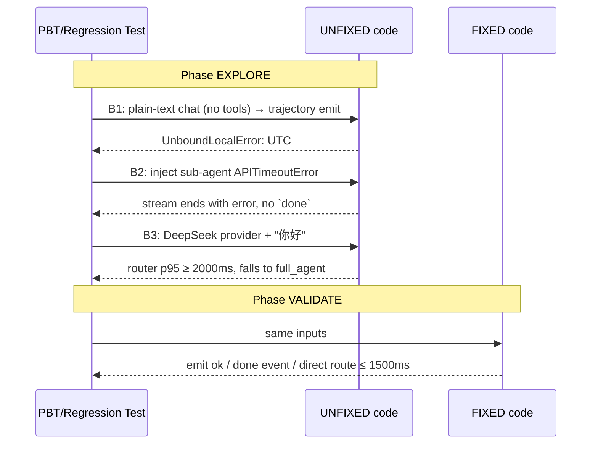

# chat-conversation-reliability-fixes — Bugfix Design

## Overview

本次修复针对 Web 对话链路三个可复现的服务端 bug（B1 / B2 / B3），并一并交付前端/观测层降级改动 B4。四条 bug 共享同一个总体策略（执行顺序：B1 → B2 → B3 → B4）：

1. **最小侵入**：只改问题函数，不重构相邻模块。
2. **保持现有可观测性口径**：新增 metric / event 要与 `agent-runtime-optimization-evolution` 已有命名对齐。
3. **双路径验证**：每个 bug 都要先有一条能在 UNFIXED 代码上失败的 PBT / 回归测试，再实现修复；修复落地后同一测试变绿即完工。



---

## Glossary

- **Bug_Condition (C)**：触发 bug 的输入集合。
- **Property (P)**：修复后对 C 内输入期望的行为断言。
- **Preservation**：C 之外（非 bug 路径）的既有行为必须保持不变。
- **`chat_stream()`**：`server/src/api/execution/router.py` 的 FastAPI 路由处理函数（第 750 行附近定义）。
- **`event_stream()`**：`chat_stream` 内部定义的 async generator（第 858 行附近），负责把 LangGraph agent 事件翻译为 SSE 事件。
- **`_agent.astream_events(...)`**：LangGraph v2 事件流，对每个 chat turn 展开 `on_chat_model_stream` / `on_tool_start` / `on_tool_end` 等事件（router.py 第 1062 行）。
- **RouterLLM**：`server/src/services/agent_runtime/router.py` 提供的三层 LLM 分类器（function_calling → json_mode → fallback_executor）。
- **RuntimeGateway**：`server/src/services/agent_runtime/gateway.py`，消费 RouterDecision 并决定走 direct / narrow graph / full_agent。
- **TrajectorySink**：`server/src/services/agent_runtime/trajectory.py` 的异步事件总线。
- **UNFIXED / FIXED**：修复前后代码。

---

## Bug Details

### Bug Condition (统一形式化)

三条主 bug 共享一个输入域 `ChatInvocation`：

```
RECORD ChatInvocation
  provider             : enum { DEEPSEEK, OPENAI, ANTHROPIC }
  message              : string                  // 用户发来的 user text
  will_trigger_tool    : boolean                 // 主 agent 本轮是否至少触发一个工具
  subagent_will_timeout: boolean                 // 子 agent LLM 调用是否会 APITimeout
  trajectory_enabled   : boolean                 // feature flag
END RECORD
```

#### B1 — UnboundLocalError 在 trajectory emit 点

```
FUNCTION isBugCondition_B1(inv)
  INPUT : inv : ChatInvocation
  OUTPUT: boolean

  RETURN inv.will_trigger_tool = FALSE
         AND inv.trajectory_enabled = TRUE
         AND event_stream reaches the `TrajectoryEvent(kind="turn", ts=datetime.now(UTC), ...)` line
END FUNCTION
```

**现场**：`chat_stream` 第 758 行 `from datetime import UTC, datetime`；`event_stream`（嵌套闭包）内第 1177 行 `from datetime import UTC`。Python 的作用域规则：对 `event_stream` 这个函数而言，**函数体内任何地方出现的赋值/import 都让该名字成为 local**，即使后面的 `from X import Y` 出现在分支里也不例外（参见 PEP 227 + `dis` 输出 `STORE_FAST UTC`）。因此 `event_stream` 的 `UTC` 是一个 local 名字，它在运行时是否被绑定取决于 1177 行是否被实际执行。当对话无工具调用时，1177 行从未执行，到了 1372 行访问 `UTC` 就是 `UnboundLocalError`。

`upload_session_file`（第 1595 行附近）结构也是顶部 `from datetime import UTC`，它不是嵌套函数所以没触发闭包 local 陷阱，但保留了容易被误抄的反模式。

#### B2 — 子 agent 超时杀掉整条 SSE 流

```
FUNCTION isBugCondition_B2(inv)
  INPUT : inv : ChatInvocation
  OUTPUT: boolean

  RETURN inv.will_trigger_tool = TRUE
         AND "task" is among the tools invoked by the main agent
         AND the sub-agent's underlying LLM call raises one of
             { openai.APITimeoutError, httpx.ConnectTimeout,
               httpx.ReadTimeout, asyncio.TimeoutError }
END FUNCTION
```

**现场**：`event_stream` 最外层只有一个 `try/except Exception` 包裹 `async for event in _agent.astream_events(...)`（第 1062 行起），异常冒上来即 `yield _sse_event("error", {...})` 后函数返回。对用户而言，这条流没有 `done` 事件，没有 `sub_agent_error` / `tool_error` 事件，前端的 SSE handler 把"未预期终止"展示为"对话没完成"。

#### B3 — RouterLLM 对 DeepSeek 每轮浪费 2s

```
FUNCTION isBugCondition_B3(inv)
  INPUT : inv : ChatInvocation
  OUTPUT: boolean

  RETURN inv.provider = DEEPSEEK
         AND RouterLLM is enabled
         AND (router_cache_miss(inv.message, user_id, last_asst_sha) = TRUE)
END FUNCTION
```

当 C_B3 为真，目前代码必然：
1. Tier 1 立即返回 None（第 362–365 行硬跳过）。
2. Tier 2 `json_mode` 吃满 2000ms 超时（`_timeout_s` 由 `DEFAULT_TIMEOUT_MS` 决定，实参为 2000）。
3. 走 `fallback_executor("parse_error")`，进而 gateway 回落 `full_agent`，装载全量工具。

即使是"你好"这种典型 direct 场景，也会被拉进 full_agent 全量重流程。

#### B4 — 冷启动窗口前端 500

```
FUNCTION isBugCondition_B4(now_t, startup_done_t)
  RETURN now_t < startup_done_t
END FUNCTION
```

### Examples

**B1 — 具体例子**

- 期望：用户发 "你好"，主 agent 不调工具直接回答，`/chat/stream` 按序产出 `status → intent → status → token* → done`，并异步 emit 一个 `TrajectoryEvent(kind="turn", outcome="ok")`。
- 实际：产出了 `token*` 和 `done`，但 `event_stream` 进入 trajectory emit 代码块时抛 `UnboundLocalError: cannot access local variable 'UTC'`（server.log 498–504），异常被 `logger.debug` 静默吞掉；最终 `agent_trajectories` 表里没有这一行，Phase C 监控误认为"没人发消息"。

**B2 — 具体例子**

- 期望：用户发 "帮我分析一下过去 1h Nginx 错误"，主 agent 调 `task(subagent_type='analysis', description=...)`；子 agent 调 DeepSeek 时 TLS 握手超时；event_stream 产出 `sub_agent_error` + `tool_error`，主 agent 拿到 `ToolMessage` 后向用户说"子任务暂时超时，请稍后重试"；最终仍发 `done`。
- 实际（server.log 289–500，913–1020）：`openai.APITimeoutError` → `event_stream` 外层 `except Exception` → `yield _sse_event("error", ...)` → return。前端收到 `error` 事件后把对话标记为失败，assistant message 的 `delivery_status=pending`。

**B3 — 具体例子**

- 期望（provider=DeepSeek）：用户发"你好"，router 在 ≤ 800ms 内判定 `route="direct"`，gateway 走 direct_answer 分支；或即便 router 超时，heuristic 也把短句闲聊归为 direct + 单轮 LLM 直答；首 token ≤ 1500ms。
- 实际（server.log 278–289，911–917）：router 必然超时 2000ms，gateway 降级到 full_agent，全量工具装配 + 全量 system prompt 再来一次，首 token 明显 > 2s。

**B4 — 具体例子**

- 启动窗（10:42:46 → 10:43:17）内页面加载 → `/api/v1/notifications/unread-count 500`（Vite 代理对 `ECONNREFUSED` 默认映射）→ 用户感知"第一次就失败"。二次刷新（startup 完成后）才看到正常数据。

---

## Expected Behavior

### Preservation Requirements

**Unchanged Behaviors（修复后 C 之外的行为必须等价）**

- `_agent.astream_events` 正常完成时的 SSE 事件序列与 `collected_steps` 内容；
- 主 agent 自身（非子 agent）抛出的 fatal 异常仍走 `yield _sse_event("error", ...)`；
- `request_approval` / `request_input` interrupt 流程；
- 非 DeepSeek provider（OpenAI、Anthropic 等）下 RouterLLM 的 function_calling → json_mode → fallback_executor 三层路径；
- router cache 命中路径；
- `promote_if_ops_keyword` 对运维关键词的提升；
- `OPS_ROUTER_SKIP_FOR_DEEPSEEK=1` 这个显式开关的兼容出口；
- `upload_session_file` 的返回结构和 `last_active_at` 字段；
- `trajectory_enabled=false` 时主路径不 emit trajectory；
- `agent-runtime-optimization-evolution` 所有现有 metric（`router_path_total`、`router_timeout_total`、`trajectory_emit_dropped` 等）的计数口径。

**Scope**

所有 `isBugCondition_B{1,2,3}` 返回 false 的输入 SHALL 在修复前后产出**逐字节相同**的 SSE 事件序列（除了新增的 error-type SSE 事件在 C 之内才出现）。

---

## Hypothesized Root Cause

### B1

1. **Python 闭包 local 绑定**：`event_stream` 内任何 `from datetime import UTC` 都把 `UTC` 变成 local；当 `on_tool_start` 分支从未执行（纯文本对话），那条 import 语句也从未执行，到 1372 行 `datetime.now(UTC)` 时 local 未绑定。
2. **历史脏演化**：作者在 `on_tool_start` 分支加 `collected_steps` 时补了一次 import，但忘了 `chat_stream` 顶部已经 import 过。
3. **`logger.debug(..., exc_info=True)` 吞异常**：使这个 bug 长期 silent，没有暴露给 Phase C 的 `trajectory_emit_dropped` 计数。

### B2

1. **`astream_events` 的错误传播语义**：LangGraph v2 中子 graph 任务抛错时 host 端通常以同一个异常 propagate，没有 per-tool/ per-subagent 的"软失败"事件。
2. **现有 catch 太宽**：最外层 `except Exception` 把所有错误都归为 fatal，未区分"应中断整条流"和"应降级为 SSE error event + 继续"。
3. **没有 ToolMessage 回灌机制**：主 agent 无从得知"子任务失败"，自然无法继续补救。

### B3

1. **DeepSeek 能力错误建模**：`_classify_via_function_calling` 把 "不支持 `tool_choice={type:tool,name:...}`" 等同于 "不支持 function_calling"。实际上 DeepSeek **支持 `tool_choice="auto"` 下的 function calling**，只是不支持 forced tool selection。直接 return None 是偷懒。
2. **硬编码 2s 超时**：`DEFAULT_TIMEOUT_MS = 2000`（看到实参 `latency=2012ms`、`2002ms`，说明 `_timeout_s=2.0`），在长 system prompt + 波动网络上必然吃满。
3. **heuristic 缺位**：R-10.6 提到"包含 ops 关键词 → 提升 executor"，但没有对称地"闲聊短句 → 短路 direct"。
4. **fallback 过激**：超时即 `full_agent`，违背 R-1.9 的"confidence < 0.4 提升为 executor"而不是 full_agent 的本意（executor 应该是一个 *narrow graph*，不是 full_agent）。

### B4

1. **后端无 `/readyz`**：Vite 探活无标的；
2. **Vite proxy 默认**对 ECONNREFUSED 的处理是把 upstream 错误透传为 500。

---

## Correctness Properties

Property 1: Bug Condition - B1 纯文本对话不触发 UnboundLocalError，trajectory 成功 emit

_For any_ `ChatInvocation inv` where `isBugCondition_B1(inv) = true`（即 `will_trigger_tool=false` 且 `trajectory_enabled=true`），修复后的 `event_stream()` SHALL 在 trajectory emit 代码块中用到的 `UTC` 名字**正确解析为 `datetime.UTC`**（不抛 `UnboundLocalError`），`TrajectorySink.emit()` SHALL 被以 `kind="turn"` 调用至少一次，事件 id SHALL 最终出现在 `agent_trajectories` 表中（或 sink 繁忙时计入 `trajectory_emit_dropped`）。

**Validates: Requirements 2.1, 2.2, 2.3, 2.4**

Property 2: Preservation - B1 修复保持已有行为

_For any_ `ChatInvocation inv` where `isBugCondition_B1(inv) = false`（包括"有工具调用"或"trajectory_enabled=false"），修复后代码 SHALL 产出与修复前**逐字节相同**的 SSE 事件序列，`collected_steps` 内容等价，`Session.last_active_at`、`assistant_msg` 持久化字段等价。

**Validates: Requirements 3.1, 3.2, 3.3**

Property 3: Bug Condition - B2 子 agent 超时不再杀流

_For any_ `ChatInvocation inv` where `isBugCondition_B2(inv) = true`（子 agent LLM 调用抛 `APITimeoutError / ConnectTimeout / ReadTimeout / asyncio.TimeoutError` 之一），修复后的 `event_stream()` SHALL 捕获该异常，产出**恰好一条** `sub_agent_error` SSE 事件和**一条** `tool_error` SSE 事件；SHALL 把错误作为 `ToolMessage` 回灌主 agent 上下文；SHALL 在最终走到 `yield _sse_event("done", ...)` 闭流；对应 `collected_steps` 条目 `status` SHALL 为 `"error"`。

**Validates: Requirements 2.5, 2.6, 2.7, 2.8**

Property 4: Preservation - B2 不影响成功路径，主 agent fatal 路径以 "error + done" 收尾

_For any_ `ChatInvocation inv` where `isBugCondition_B2(inv) = false`（子 agent 正常成功 OR 异常类型不在白名单），修复后代码 SHALL 等价于修复前：正常成功时 `sub_agent_end` → `tool_end` 顺序不变。

_Additionally_ 当主 agent 自身抛非白名单异常触发 fatal 路径时，修复后 `event_stream` 的 SSE 序列 SHALL 以 "倒数第二条 `error` + 最后一条 `done`" 的两段式收尾（`done.reply` 退化为 `final_answer or "对话异常结束"`），对应 assistant message 的 `delivery_status` SHALL 被置为 `failed`（与正常 `delivered` 区分），SHALL NOT 出现"只有孤立 `error`、无 `done`"的老行为。

**Validates: Requirements 3.4, 3.5, 3.6, 3.7**

Property 5: Bug Condition - B3 DeepSeek 短句闲聊快速走 direct

_For any_ `ChatInvocation inv` where `isBugCondition_B3(inv) = true` AND `len(inv.message.strip()) ≤ OPS_ROUTER_HEURISTIC_MAX_LEN（默认 6） AND not contains_ops_keyword(inv.message)`（典型"你好"、"嗯"、"ok"），修复后 `RouterLLM.classify(...)` SHALL 在 p95 ≤ 250ms 内（heuristic short-circuit 不调 LLM）返回 `RouterDecision(route="direct", confidence≥0.7)`；Gateway SHALL 走 direct_answer 分支（单轮 LLM 直答），SHALL NOT 触发 `full_agent` 装配。当 `OPS_ROUTER_HEURISTIC_MAX_LEN=0` 显式关闭 heuristic 时，SHALL 回到修复前（无 heuristic）的路径语义（该出口被 Property 6 覆盖）。

_Additionally for any_ `ChatInvocation inv` where `isBugCondition_B3(inv) = true` AND router LLM 确实被调用且超时（`OPS_ROUTER_TIMEOUT_MS` 默认 800ms 生效），修复后 SHALL 走 heuristic 路径（短句 direct / 含 ops 关键词 executor + empty tools），SHALL NOT 默认回落到 `full_agent`。

**Validates: Requirements 2.9, 2.10, 2.11, 2.12, 2.13**

Property 6: Preservation - B3 非 DeepSeek / 运维关键词 / 缓存命中 不变

_For any_ `ChatInvocation inv` where `isBugCondition_B3(inv) = false`（provider 非 DeepSeek、router 缓存命中、或消息含运维关键词）OR `OPS_ROUTER_SKIP_FOR_DEEPSEEK=1` 显式被设置，修复后 RouterLLM 的行为 SHALL 等价于修复前。

**Validates: Requirements 3.8, 3.9, 3.10, 3.11**

Property 7: Bug Condition / Preservation - B4 冷启动窗口

_For any_ 页面加载 where `isBugCondition_B4(now, startup_done) = true`，修复后 Vite dev proxy 或前端 SHALL 不再产生未处理的 5xx 红条（退避重试 + 占位 或 `/readyz` 探活 + 503）；`isBugCondition_B4(...) = false` 时，所有业务端点响应 SHALL 与修复前等价。

**Validates: Requirements 2.14, 2.15, 3.12**

---

## Fix Implementation

### B1 — 最小 diff

**File**: `server/src/api/execution/router.py`

**Function**: `event_stream()`（`chat_stream` 的嵌套闭包，约第 858 行起）和 `upload_session_file()`（约第 1595 行）。

**Specific Changes**:

1. **移除 `event_stream` 内第 1177 行的 `from datetime import UTC` 和第 1179 行的 `from datetime import datetime as _dt`**。
2. **使用 `chat_stream` 顶部第 758 行已 import 的 `UTC, datetime`**；把 1181 行 `_dt.now(UTC).timestamp()` 改为 `datetime.now(UTC).timestamp()`。
3. **核对 `upload_session_file`（第 1595–1598 行）**：保留现有顶部 `from datetime import UTC` / `from datetime import datetime as _datetime` 写法（不在嵌套闭包里，闭包陷阱不触发），但加一行注释指明："导入放在函数顶部，避免在内部分支中重复 import 触发 Python local 绑定陷阱"。
4. **不改动** `logger.debug("trajectory emit ...", exc_info=True)` 本身（保持向后兼容），但要求 B1 修复后这条分支在 C_B1 的输入上不再被命中；通过测试 Property 1 保证。
5. **补一条 debug assert**（可选、守护性）：在 trajectory emit 前 `assert isinstance(UTC, type(datetime.timezone.utc))`，方便未来回归。

### B2 — 最小 diff

**File**: `server/src/api/execution/router.py`

**Function**: `event_stream()` 的 `async for event in _agent.astream_events(...)` 循环体外层异常处理。

**Specific Changes**:

1. **新增超时异常白名单**：
   ```python
   import openai as _openai_mod
   import httpx as _httpx_mod
   _SUBAGENT_TIMEOUT_ERRORS = (
       _openai_mod.APITimeoutError,
       _httpx_mod.ConnectTimeout,
       _httpx_mod.ReadTimeout,
       asyncio.TimeoutError,
   )
   ```
2. **把 `async for event in _agent.astream_events(...)` 放进一个内部 `while True` + `try/except _SUBAGENT_TIMEOUT_ERRORS`**，并配合一个 `last_active_tool_run_id`（根据 `on_tool_start` 时记录的 run_id / name）在 except 分支复原：
   - yield `sub_agent_error` + `tool_error` SSE 事件；
   - 把错误作为 `ToolMessage(tool_call_id=<tool_call_id>, content=...)` append 到 `agent_messages`；
   - 更新 `collected_steps` 对应条目 status=`error`、output=truncated error；
   - 重新启动一次 `_agent.astream_events({"messages": agent_messages})`（continue）。
   
   如果白名单内错误在**连续** N=2 次重入内仍出现，才升级为 fatal 退出（避免死循环）。
3. **保留** `except Exception as exc` 的 fatal 路径（主 agent 自身错误或非白名单错误），锁定"先 error 再 done"单一方案：except 分支先 `yield _sse_event("error", {...})`，然后 **fall-through 到闭流逻辑** —— `yield _sse_event("done", {"session_id": session_id, "reply": final_answer or "对话异常结束"})`；同时把 assistant message 的 `delivery_status` 置为 `"failed"`（与正常 `"delivered"` 区分），`extra_metadata.execution_steps` 中未完成的 step 标记为 `error`。此分支不再提供"不发 done"或"只发 done"等替代选项。
4. **归因 run_id → tool_name**：借助 `on_tool_start` 已经维护的 `tool_step_map`，在 except 时通过 langchain 异常的 `during task with name 'model' and id 'XXX'` context（见 server.log 行 493："During task with name 'model' and id 'f62dde69-...'"）抓不到 task 归因；以 `seen_task_ids` 最后一个 active id 为保守替代，或干脆对异常冒泡时以"最近一个 `task` tool start"作归因。

### B3 — 最小 diff

**File**: `server/src/services/agent_runtime/router.py`

**Function**: `RouterLLM.__init__` / `classify` / `_classify_via_function_calling`；新增顶层 heuristic。

**Specific Changes**:

1. **环境变量开关** `OPS_ROUTER_SKIP_FOR_DEEPSEEK`（默认 `"0"` → 允许尝试；`"1"` 保持当前行为）。在 `_classify_via_function_calling` 中替换第 362–365 行硬跳过：
   ```python
   if is_deepseek and _env_flag("OPS_ROUTER_SKIP_FOR_DEEPSEEK", default=False):
       return None
   if is_deepseek:
       # DeepSeek supports tool_choice="auto" but not forced tool selection
       bound = llm.bind_tools([RouterDecisionTool], tool_choice="auto")
   else:
       bound = llm.bind_tools([RouterDecisionTool], tool_choice={"type": "tool", "name": "decide"})
   response = await bound.ainvoke(messages)
   return _parse_tool_call(response)
   ```
2. **超时窗口**：`DEFAULT_TIMEOUT_MS` 由 2000 调整为 800（或通过 `OPS_ROUTER_TIMEOUT_MS` 覆盖）。兼容：保留 `timeout_ms` 构造参数。
3. **Heuristic short-circuit**（`classify` 顶部、在 cache lookup 之后、Tier 1 之前）：
   ```
   _OPS_ROUTER_HEURISTIC_MAX_LEN = int(os.environ.get("OPS_ROUTER_HEURISTIC_MAX_LEN", "6"))
   # 放在模块级（或通过 RouterLLM.__init__ 注入，便于测试 monkeypatch）

   FUNCTION heuristic_direct(message)
     trimmed := strip(message)
     IF _OPS_ROUTER_HEURISTIC_MAX_LEN > 0
        AND len(trimmed) <= _OPS_ROUTER_HEURISTIC_MAX_LEN
        AND NOT contains_ops_keyword(trimmed) THEN
       RETURN RouterDecision(route="direct", direct_answer=None, confidence=0.8, reason="heuristic_short_greeting")
     ELSE
       RETURN None
     END IF
   END FUNCTION
   ```
   注意：`direct_answer=None` 时 gateway 的 direct 分支会请一次轻量 LLM 直答（不装载工具），仍比 full_agent 快得多。阈值环境变量 `OPS_ROUTER_HEURISTIC_MAX_LEN` 默认 `6`；设为 `0` 即完全关闭 heuristic，作为"第二个 back-compat 出口"（另一个是 `OPS_ROUTER_SKIP_FOR_DEEPSEEK`）。
4. **Tier 3 兜底调整**：超时/解析失败时，若 `contains_ops_keyword(message)` → `RouterDecision(route="executor", suggested_tools=[], confidence=0.3)`（narrow graph 装载受限工具）；否则 → `RouterDecision(route="direct", direct_answer=None, confidence=0.3)`（让 gateway 走 LLM 直答）。明确 **不再默认 full_agent 兜底**（full_agent 只在 gateway 判定 narrow graph 装配失败时作为最终保险）。
5. **Metric 对齐**：新增 `router_path="heuristic_direct"` 分类计数，保留 `function_calling` / `json_mode` / `fallback_executor` 原有计数（保持 R-6.2 `router_path_total` 标签口径不回退）。

### B4 — 最小范围

**Files**: `server/src/main.py`（新增 `/readyz` 路由）+ `web/vite.config.ts`（dev proxy `onProxyError` 钩子）+ `web/src/api/*`（axios response interceptor）。

**Specific Changes**:

1. **后端新增 `GET /readyz`**：依次检查以下三项，任一失败整体返回 HTTP `503` + JSON body `{"ready": false, "pending": [<失败项名>...]}`，全部通过返回 `200` + `{"ready": true}`：
   - `async_session_factory` 可以建立连接（执行一个 `SELECT 1` 心跳）；
   - Redis `ping()` 成功；
   - `get_deep_agent()` 已预热完成（进程级 once-flag）。
2. **Vite dev proxy `onProxyError`**：在 `vite.config.ts`（或等价 dev proxy 配置）中为 `/api/v1/*` 配置 `onProxyError`，当 upstream 为 `ECONNREFUSED` 或返回启动期的非 2xx 时，proxy SHALL 改写响应为 HTTP `503` + JSON `{"ready": false, "cold_start": true}`（**不**要返 500，避免和后端真实 5xx 混淆）。
3. **前端统一 axios response interceptor**（`web/src`）：对所有 `/api/v1/*` 的响应，当 `status === 503 && body.cold_start === true` 时做指数退避重试 `250ms / 500ms / 1000ms`（最多 3 次）；3 次仍失败则触发一次轻量 toast 并由调用方渲染占位态。对 5xx 且非 cold_start 仍走原错误处理分支（不退避、不吞错）。
4. **Metric**：新增 `backend_cold_start_requests_total{path}` 计数（由 Vite proxy 侧日志或后端 `/readyz` 统计近似），不改业务指标口径。

---

## Testing Strategy

### Validation Approach

每个 bug 严格走 explore → validate 两阶段：

1. 在 **UNFIXED 代码**上先写测试并跑它，观察失败现象（counterexample），用来"证伪"代码当前正确。
2. 应用修复后，**同一条测试**必须变绿。
3. 对 preservation 一侧，用 PBT 在 UNFIXED 代码上采样一批"C 之外输入"，记录输出作为 golden baseline，修复后重放应得到相同 baseline。

### Exploratory Bug Condition Checking

**目标**：在 UNFIXED 代码上，产出三份 counterexample 证明 B1 / B2 / B3 存在；这些就是 `tasks.md` 里 Task 1 的终点。

**Test Plan**：

- B1：用 `FastAPI` 的 `TestClient` 打 `POST /api/v1/chat/stream`，身份走 `test user`，模型 provider 打桩为会"直接返回 final text 不调工具"的 stub LLM，`trajectory_enabled=true`；断言 SSE 序列中出现 `done` 且 `TrajectorySink.emit` 被调用**至少一次**。在 UNFIXED 代码上该断言失败（emit 抛 UnboundLocalError 被 logger.debug 吞）。也可做白盒单测：直接 patch `chat_stream` 只跑 trajectory emit 代码块，断言不抛 `UnboundLocalError`。
- B2：打桩主 agent 在"第一个工具调用是 `task`"之后让子 agent 的 LLM 抛 `openai.APITimeoutError`；断言 SSE 序列**最后一条是 `done`**（不是 `error`）且包含**至少一条** `sub_agent_error` + `tool_error`。在 UNFIXED 代码上最后一条是 `error` 且无 `done`。
- B3：PBT `provider=DEEPSEEK`、`message` 从 `{"你好","嗯","ok","hi","早"}` 采样、router cache 清空；断言 `RouterLLM.classify` p95 延迟 ≤ 250ms **AND** 返回 `route="direct"`；断言 gateway 日志不出现 `using full_agent fallback`。在 UNFIXED 代码上 p95 ≥ 2000ms 且走 full_agent。

**Expected Counterexamples**：

- B1：`UnboundLocalError: cannot access local variable 'UTC'`（server.log 503）。
- B2：SSE stream ends with `event: error` and no `event: done`.
- B3：`router: json_mode timed out after 2000ms` + `gateway: using full_agent fallback`（server.log 285–288、913–917）。

### Fix Checking

**Goal**：对 C 内输入，FIXED 代码满足 P。

**Pseudocode (B1)**:
```
FOR ALL inv WHERE isBugCondition_B1(inv) DO
  result := run_chat_stream(inv)
  ASSERT result.status = "ok"
  ASSERT result.sse_events contains "done"
  ASSERT TrajectorySink.emit.called_at_least_once
  ASSERT no UnboundLocalError raised on server side
END FOR
```

**Pseudocode (B2)**:
```
FOR ALL inv WHERE isBugCondition_B2(inv) DO
  result := run_chat_stream(inv)
  ASSERT result.sse_events contains ≥1 "sub_agent_error"
  ASSERT result.sse_events contains ≥1 "tool_error"
  ASSERT result.sse_events.last == "done"
  ASSERT collected_step_for_task(inv).status == "error"
END FOR
```

**Pseudocode (B3)**:
```
FOR ALL inv WHERE isBugCondition_B3(inv) AND is_short_greeting(inv.message) DO
  t0 := now()
  decision := RouterLLM.classify(inv.message, user_id=..., ...)
  ASSERT (now() - t0) ≤ 250ms    // heuristic short-circuit, no LLM
  ASSERT decision.route = "direct"
  ASSERT decision.confidence ≥ 0.7
END FOR

FOR ALL inv WHERE isBugCondition_B3(inv) AND router_llm_is_called(inv) AND router_llm_timeouts(inv) DO
  decision := RouterLLM.classify(inv.message, ...)
  ASSERT decision.route IN {"direct", "executor"}
  ASSERT gateway(inv, decision).final_path ≠ "full_agent"
END FOR
```

### Preservation Checking

**Goal**：对 C 之外输入，FIXED 代码与 UNFIXED 等价。

**Pseudocode**:
```
FOR ALL inv WHERE NOT isBugCondition_B1(inv) DO
  ASSERT run_chat_stream_ORIGINAL(inv).sse_events = run_chat_stream_FIXED(inv).sse_events
END FOR

FOR ALL inv WHERE NOT isBugCondition_B2(inv) DO
  ASSERT stream_FIXED(inv).tail_event = stream_ORIGINAL(inv).tail_event
END FOR

FOR ALL inv WHERE NOT isBugCondition_B3(inv) DO
  ASSERT RouterLLM_FIXED(inv).decision = RouterLLM_ORIGINAL(inv).decision
  ASSERT RouterLLM_FIXED(inv).chosen_path = RouterLLM_ORIGINAL(inv).chosen_path
END FOR
```

**Testing Approach**: 强烈推荐用 PBT（pytest + `hypothesis`，项目已在 `.hypothesis/` 有历史使用痕迹）生成：

- 随机 `ChatInvocation`（provider、will_trigger_tool、subagent_will_timeout、trajectory_enabled、message 来自一组预定义字串）。
- 对 UNFIXED 代码采样 100 条非 bug 输入，录制 SSE 序列 + router decision 作为 golden；FIXED 代码重放同样输入应得相同 golden。

**Test Plan**:

1. **B1 preservation**：固定一组"有工具调用"的 scripted agent stream（至少 3 条：单工具、多工具、多子 agent），录制 UNFIXED 输出，断言 FIXED 输出等价。
2. **B2 preservation**：固定"子 agent 正常完成"脚本，断言 UNFIXED/FIXED 输出等价；另加一条"主 agent 抛 `ValueError` 非白名单"脚本，断言 UNFIXED/FIXED 均以 `error` 事件收尾。
3. **B3 preservation**：OpenAI / Anthropic provider 下采样 50 条混合消息（含 ops 关键词 / 不含 / 缓存命中 / 未命中），断言 RouterLLM 决策与 `chosen_path` 与 UNFIXED 等价。

### Unit Tests

- `test_router_event_stream_unboundlocal_utc`（B1）
- `test_router_upload_session_file_utc_not_shadowed`（B1 相关防御）
- `test_event_stream_catches_subagent_timeout_emits_done`（B2）
- `test_event_stream_main_agent_fatal_still_error_event`（B2 preservation）
- `test_routerllm_deepseek_short_greeting_direct_fast`（B3）
- `test_routerllm_deepseek_opts_out_backcompat`（B3 preservation，`OPS_ROUTER_SKIP_FOR_DEEPSEEK=1` 仍走旧路径）
- `test_routerllm_non_deepseek_unchanged`（B3 preservation）

### Property-Based Tests

- **P-B1**：random `ChatInvocation` with `will_trigger_tool=false` → 必然不抛 UnboundLocalError + emit 至少一次。
- **P-B2**：random 子 agent LLM 异常（从白名单中抽取类型）→ SSE 尾部必为 `done` 且含 `sub_agent_error + tool_error`。
- **P-B3**：random provider + random message（含/不含 ops 关键词 + 长度 1..20）→
  - 若短闲聊：p95 ≤ 250ms + direct；
  - 若含 ops 关键词：最终路径不是 full_agent（除非非 DeepSeek 原路径就是 full_agent）。
- **P-Preservation**：random non-C 输入，比较 UNFIXED vs FIXED（录播对拍）。

### Integration Tests

- **I-1**：端到端 `POST /chat/stream`（provider=DeepSeek stub）发 "你好"，断言首 token ≤ 1500ms（integration-friendly budget）且 trajectory 入库。
- **I-2**：`POST /chat/stream` 主 agent 调 `task` 子 agent，注入 DeepSeek TLS 超时，断言对话以 `done` 收尾且 assistant message 的 `delivery_status=delivered`、`extra_metadata.execution_steps[?name=='task'].status=='error'`。
- **I-3**（B4）：启动窗模拟，断言前端 fetch 包装层在 3 次重试内拿到 2xx 或呈现占位态，Console 无未处理的 5xx 红条。
