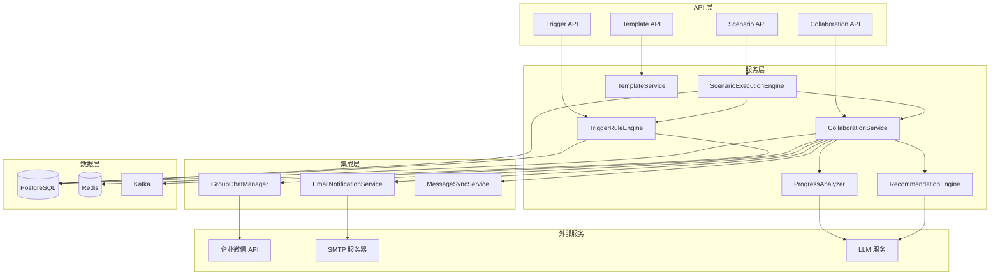
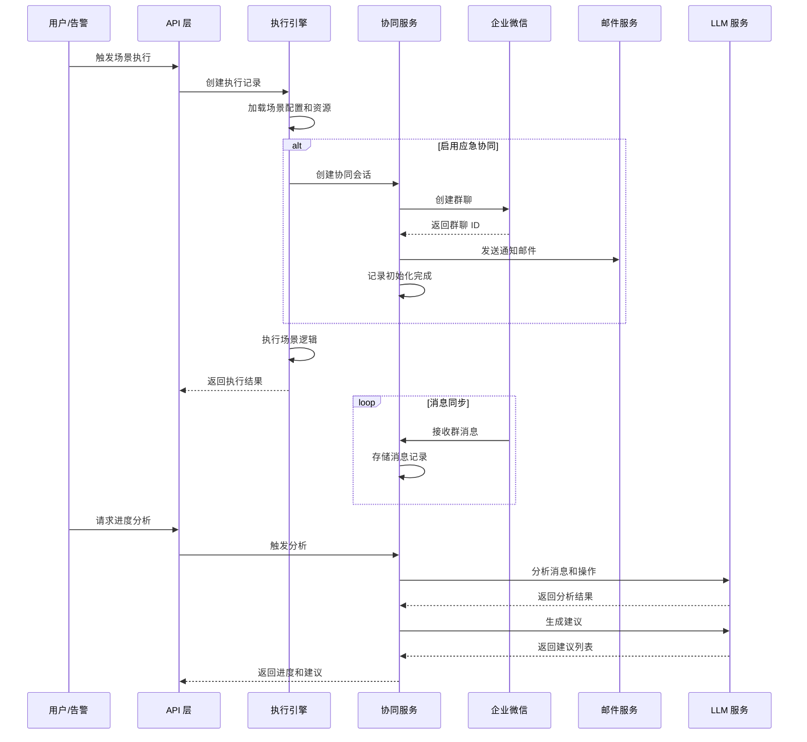

# 技术设计文档：场景运维优化与应急协同

## 概述

本设计文档描述 AIOpsOS 平台的场景运维优化和应急协同功能的技术实现方案。该功能包含两个核心模块：

1. **场景运维优化**：扩展现有 Scenario 模型，支持多种场景类型（命令式、自然语言式、混合式），提供标准化场景模板，增强触发条件配置，并支持场景与多种资源的关联。

2. **应急协同**：在场景触发时自动启动协同工作流，包括创建企业微信群、发送邮件通知、消息同步、进度分析和下一步建议生成。

### 设计目标

- 向后兼容现有 Scenario、SceneTrigger、Schedule 模型
- 复用现有的 NotificationChannel 和企业微信/邮件渠道实现
- 提供可扩展的场景模板系统
- 实现完整的应急协同生命周期管理
- 支持智能进度分析和建议生成

### 技术栈

- 后端：Python 3.12 + FastAPI + SQLAlchemy 2.0
- 数据库：PostgreSQL 16 + pgvector
- 消息队列：Kafka（用于异步任务）
- 缓存：Redis（用于频率限制、状态缓存）
- 企业微信：应用 API + Bot WebSocket
- 邮件：SMTP

## 架构

### 系统架构图



### 核心流程



## 组件和接口

### 1. 数据模型扩展

#### 1.1 Scenario 模型扩展

扩展现有 `Scenario` 模型，新增字段支持场景类型和应急协同配置：

```python
# server/src/models/agent.py - Scenario 模型扩展

class Scenario(Base, TimestampMixin):
    __tablename__ = "scenarios"

    # 现有字段
    id: Mapped[uuid.UUID] = mapped_column(UUID(as_uuid=True), primary_key=True, default=uuid.uuid4)
    name: Mapped[str] = mapped_column(String(256), unique=True, nullable=False)
    description: Mapped[str | None] = mapped_column(Text, nullable=True)
    trigger_command: Mapped[str] = mapped_column(String(128), nullable=False)
    params_schema: Mapped[dict] = mapped_column(JSONB, default=dict)
    is_active: Mapped[bool] = mapped_column(Boolean, default=True)
    space_id: Mapped[uuid.UUID | None] = mapped_column(
        UUID(as_uuid=True), ForeignKey("spaces.id", ondelete="SET NULL"), nullable=True
    )

    # 新增字段
    scenario_type: Mapped[str] = mapped_column(
        String(32), nullable=False, default="command", server_default="command"
    )  # command | natural_language | hybrid
    nl_prompt: Mapped[str | None] = mapped_column(Text, nullable=True)
    template_id: Mapped[str | None] = mapped_column(String(64), nullable=True)
    execution_timeout: Mapped[int] = mapped_column(
        Integer, nullable=False, default=300, server_default="300"
    )  # 秒
    
    # 应急协同配置
    enable_collaboration: Mapped[bool] = mapped_column(
        Boolean, nullable=False, default=False, server_default="false"
    )
    collaboration_config: Mapped[dict] = mapped_column(JSONB, default=dict)
    # collaboration_config 结构:
    # {
    #   "auto_create_group": true,
    #   "group_name_template": "[应急] {scenario_name} - {timestamp}",
    #   "group_members": ["user1", "user2"],
    #   "group_owner": "admin",
    #   "send_email": true,
    #   "email_recipients": ["ops@example.com"],
    #   "email_template_id": "emergency_alert"
    # }

    # 现有关系
    tools: Mapped[list["Tool"]] = relationship(secondary="scenario_tools", back_populates="scenarios")
    agents: Mapped[list["Agent"]] = relationship(secondary="scenario_agents", back_populates="scenarios")
    
    # 新增关系
    knowledge_docs: Mapped[list["KnowledgeDocument"]] = relationship(
        secondary="scenario_knowledge_docs"
    )
    notification_channels: Mapped[list["NotificationChannel"]] = relationship(
        secondary="scenario_channels"
    )
    executions: Mapped[list["ScenarioExecution"]] = relationship(
        back_populates="scenario", order_by="ScenarioExecution.created_at.desc()"
    )
```

#### 1.2 新增关联表

```python
# server/src/models/agent.py - 新增关联表

scenario_knowledge_docs = Table(
    "scenario_knowledge_docs",
    Base.metadata,
    Column("scenario_id", UUID(as_uuid=True), ForeignKey("scenarios.id", ondelete="CASCADE"), primary_key=True),
    Column("document_id", UUID(as_uuid=True), ForeignKey("knowledge_documents.id", ondelete="CASCADE"), primary_key=True),
)

scenario_channels = Table(
    "scenario_channels",
    Base.metadata,
    Column("scenario_id", UUID(as_uuid=True), ForeignKey("scenarios.id", ondelete="CASCADE"), primary_key=True),
    Column("channel_id", UUID(as_uuid=True), ForeignKey("notification_channels.id", ondelete="CASCADE"), primary_key=True),
)
```

#### 1.3 ScenarioExecution 模型

```python
# server/src/models/scenario.py - 新文件

class ScenarioExecution(Base, TimestampMixin):
    """场景执行记录"""
    __tablename__ = "scenario_executions"

    id: Mapped[uuid.UUID] = mapped_column(UUID(as_uuid=True), primary_key=True, default=uuid.uuid4)
    scenario_id: Mapped[uuid.UUID] = mapped_column(
        UUID(as_uuid=True), ForeignKey("scenarios.id", ondelete="CASCADE")
    )
    trigger_type: Mapped[str] = mapped_column(String(32), nullable=False)  # manual | schedule | trigger_rule
    trigger_source: Mapped[str | None] = mapped_column(String(256), nullable=True)  # 触发来源描述
    status: Mapped[str] = mapped_column(
        String(32), nullable=False, default="pending"
    )  # pending | running | completed | failed | timeout
    params: Mapped[dict] = mapped_column(JSONB, default=dict)
    result: Mapped[dict] = mapped_column(JSONB, default=dict)
    # result 结构:
    # {
    #   "output": "执行输出内容",
    #   "recommendations": ["建议1", "建议2"],
    #   "metrics": {"duration_ms": 1234, "steps_completed": 5}
    # }
    logs: Mapped[list] = mapped_column(JSONB, default=list)
    # logs 结构: [{"timestamp": "...", "level": "info", "message": "..."}]
    started_at: Mapped[datetime | None] = mapped_column(DateTime(timezone=True), nullable=True)
    completed_at: Mapped[datetime | None] = mapped_column(DateTime(timezone=True), nullable=True)
    collaboration_session_id: Mapped[uuid.UUID | None] = mapped_column(
        UUID(as_uuid=True), ForeignKey("collaboration_sessions.id", ondelete="SET NULL"), nullable=True
    )
    space_id: Mapped[uuid.UUID | None] = mapped_column(
        UUID(as_uuid=True), ForeignKey("spaces.id", ondelete="SET NULL"), nullable=True
    )

    scenario: Mapped["Scenario"] = relationship(back_populates="executions")
    collaboration_session: Mapped["CollaborationSession | None"] = relationship(back_populates="execution")
```

#### 1.4 CollaborationSession 模型

```python
# server/src/models/collaboration.py - 新文件

class CollaborationSession(Base, TimestampMixin):
    """应急协同会话"""
    __tablename__ = "collaboration_sessions"

    id: Mapped[uuid.UUID] = mapped_column(UUID(as_uuid=True), primary_key=True, default=uuid.uuid4)
    scenario_id: Mapped[uuid.UUID] = mapped_column(
        UUID(as_uuid=True), ForeignKey("scenarios.id", ondelete="CASCADE")
    )
    status: Mapped[str] = mapped_column(
        String(32), nullable=False, default="created"
    )  # created | active | resolved | closed
    trigger_reason: Mapped[str | None] = mapped_column(Text, nullable=True)
    
    # 群聊信息
    group_chat_id: Mapped[str | None] = mapped_column(String(64), nullable=True)
    group_chat_name: Mapped[str | None] = mapped_column(String(256), nullable=True)
    
    # 进度信息
    progress_summary: Mapped[dict] = mapped_column(JSONB, default=dict)
    # progress_summary 结构:
    # {
    #   "current_phase": "investigation",
    #   "completed_steps": ["问题确认", "初步排查"],
    #   "pending_items": ["根因分析", "修复验证"],
    #   "duration_minutes": 45,
    #   "last_analysis_at": "2024-01-01T12:00:00Z"
    # }
    
    # 配置快照
    config_snapshot: Mapped[dict] = mapped_column(JSONB, default=dict)
    
    resolved_at: Mapped[datetime | None] = mapped_column(DateTime(timezone=True), nullable=True)
    closed_at: Mapped[datetime | None] = mapped_column(DateTime(timezone=True), nullable=True)
    summary_report: Mapped[dict | None] = mapped_column(JSONB, nullable=True)
    space_id: Mapped[uuid.UUID | None] = mapped_column(
        UUID(as_uuid=True), ForeignKey("spaces.id", ondelete="SET NULL"), nullable=True
    )

    scenario: Mapped["Scenario"] = relationship()
    execution: Mapped["ScenarioExecution | None"] = relationship(back_populates="collaboration_session")
    messages: Mapped[list["CollaborationMessage"]] = relationship(
        back_populates="session", order_by="CollaborationMessage.created_at"
    )
    recommendations: Mapped[list["CollaborationRecommendation"]] = relationship(
        back_populates="session", order_by="CollaborationRecommendation.created_at.desc()"
    )
```

#### 1.5 CollaborationMessage 模型

```python
class CollaborationMessage(Base):
    """协同会话消息记录"""
    __tablename__ = "collaboration_messages"

    id: Mapped[uuid.UUID] = mapped_column(UUID(as_uuid=True), primary_key=True, default=uuid.uuid4)
    session_id: Mapped[uuid.UUID] = mapped_column(
        UUID(as_uuid=True), ForeignKey("collaboration_sessions.id", ondelete="CASCADE")
    )
    source_channel: Mapped[str] = mapped_column(String(32), nullable=False)  # wecom | email | system | api
    source_message_id: Mapped[str | None] = mapped_column(String(128), nullable=True)
    sender_id: Mapped[str | None] = mapped_column(String(128), nullable=True)
    sender_name: Mapped[str | None] = mapped_column(String(256), nullable=True)
    content: Mapped[str] = mapped_column(Text, nullable=False)
    message_type: Mapped[str] = mapped_column(String(32), nullable=False, default="text")  # text | markdown | event
    msg_metadata: Mapped[dict] = mapped_column("metadata", JSONB, default=dict)
    synced_to: Mapped[list] = mapped_column(JSONB, default=list)  # ["wecom", "email"]
    created_at: Mapped[datetime] = mapped_column(
        DateTime(timezone=True), default=lambda: datetime.now(UTC), server_default=func.now()
    )

    session: Mapped["CollaborationSession"] = relationship(back_populates="messages")
```

#### 1.6 CollaborationRecommendation 模型

```python
class CollaborationRecommendation(Base, TimestampMixin):
    """协同会话建议记录"""
    __tablename__ = "collaboration_recommendations"

    id: Mapped[uuid.UUID] = mapped_column(UUID(as_uuid=True), primary_key=True, default=uuid.uuid4)
    session_id: Mapped[uuid.UUID] = mapped_column(
        UUID(as_uuid=True), ForeignKey("collaboration_sessions.id", ondelete="CASCADE")
    )
    content: Mapped[str] = mapped_column(Text, nullable=False)
    priority: Mapped[int] = mapped_column(Integer, nullable=False, default=0)  # 0=low, 1=medium, 2=high
    estimated_impact: Mapped[str | None] = mapped_column(String(256), nullable=True)
    reference_docs: Mapped[list] = mapped_column(JSONB, default=list)  # [{"doc_id": "...", "title": "..."}]
    status: Mapped[str] = mapped_column(
        String(32), nullable=False, default="pending"
    )  # pending | adopted | ignored | modified
    feedback: Mapped[str | None] = mapped_column(Text, nullable=True)
    adopted_at: Mapped[datetime | None] = mapped_column(DateTime(timezone=True), nullable=True)

    session: Mapped["CollaborationSession"] = relationship(back_populates="recommendations")
```

### 2. SceneTrigger 模型扩展

扩展现有 `SceneTrigger` 模型，支持更丰富的触发条件：

```python
# server/src/models/schedule.py - SceneTrigger 扩展

class SceneTrigger(Base, TimestampMixin):
    __tablename__ = "scene_triggers"

    # 现有字段保持不变
    id: Mapped[uuid.UUID] = mapped_column(UUID(as_uuid=True), primary_key=True, default=uuid.uuid4)
    name: Mapped[str] = mapped_column(String(256), nullable=False)
    condition: Mapped[dict] = mapped_column(JSONB, nullable=False)
    # condition 结构扩展:
    # {
    #   "type": "and" | "or" | "simple",
    #   "conditions": [...],  # 用于 and/or
    #   "field": "severity",  # 用于 simple
    #   "op": "eq" | "neq" | "in" | "not_in" | "contains" | "gt" | "lt" | "gte" | "lte" | "regex" | "trend",
    #   "value": "critical",
    #   "trend_config": {  # 用于 trend 操作符
    #     "metric": "cpu_usage",
    #     "direction": "rising" | "falling" | "volatile",
    #     "threshold": 0.2,
    #     "window_minutes": 30
    #   }
    # }
    scenario_id: Mapped[uuid.UUID] = mapped_column(
        UUID(as_uuid=True), ForeignKey("scenarios.id", ondelete="CASCADE")
    )
    frequency_limit: Mapped[int | None] = mapped_column(Integer, nullable=True)
    time_window_start: Mapped[datetime | None] = mapped_column(Time, nullable=True)
    time_window_end: Mapped[datetime | None] = mapped_column(Time, nullable=True)
    space_id: Mapped[uuid.UUID | None] = mapped_column(
        UUID(as_uuid=True), ForeignKey("spaces.id", ondelete="SET NULL"), nullable=True
    )
    is_active: Mapped[bool] = mapped_column(Boolean, default=True)

    # 新增字段
    description: Mapped[str | None] = mapped_column(Text, nullable=True)
    last_triggered_at: Mapped[datetime | None] = mapped_column(DateTime(timezone=True), nullable=True)
    trigger_count: Mapped[int] = mapped_column(Integer, nullable=False, default=0, server_default="0")
```
